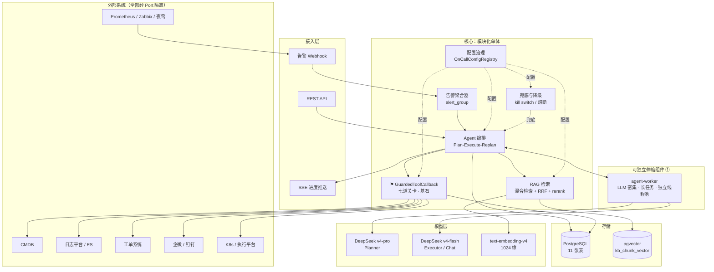
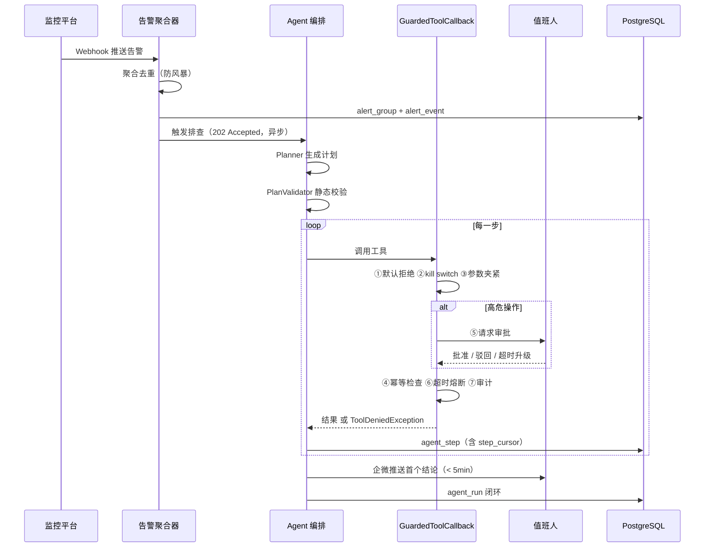
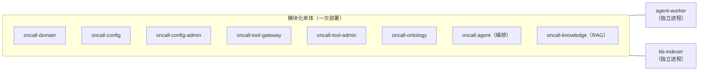
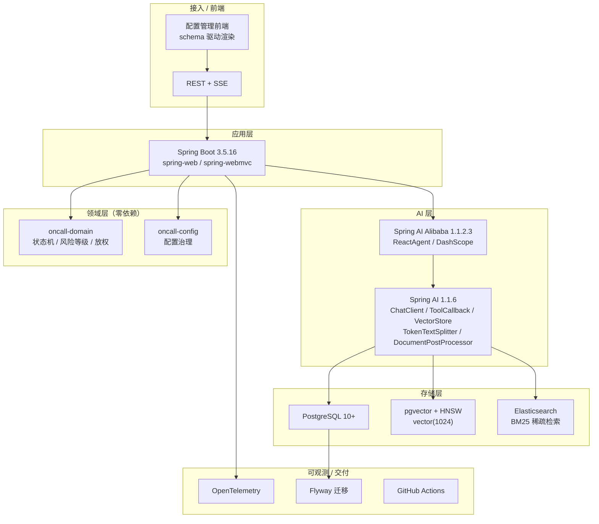
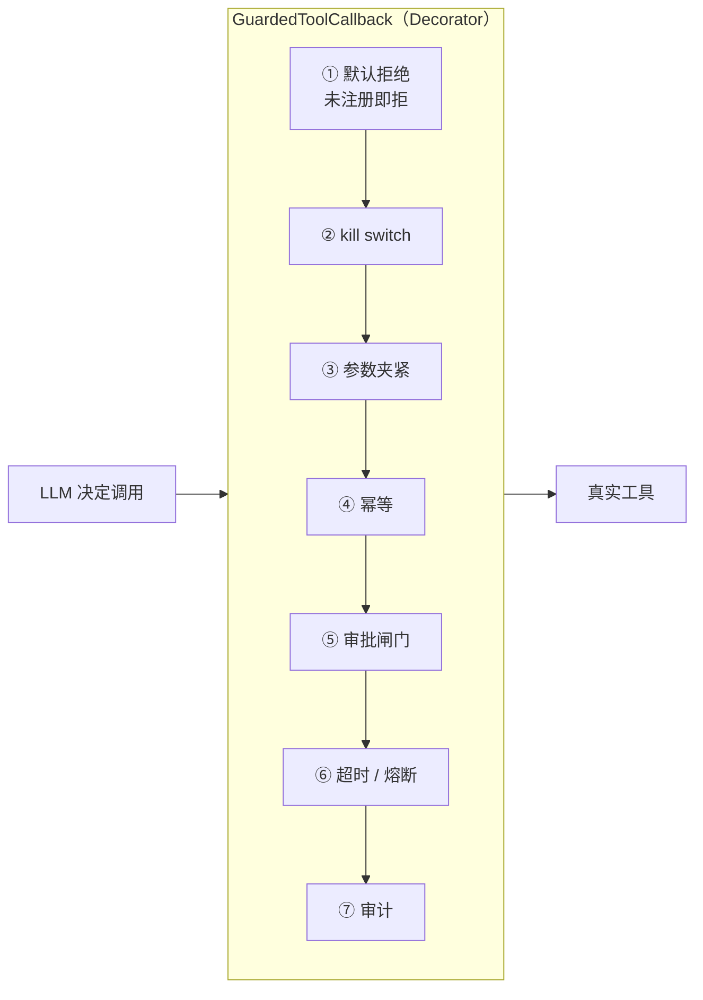
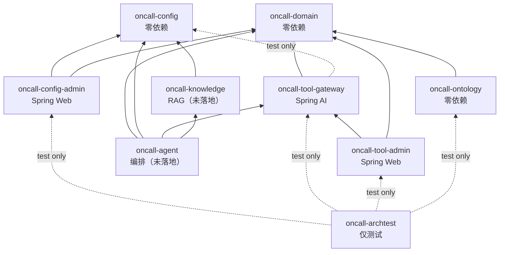

# 2. 项目整体架构和技术栈选型分析设计文档

| 项 | 内容 |
|----|------|
| 关联文档 | [架构评审报告.md](架构评审报告.md)（查出的问题）、[修复方案.md](修复方案.md)（修订结论）、[DEVELOPMENT.md](DEVELOPMENT.md)（施工进度） |
| 与原始方案的关系 | [架构设计方案.md](架构设计方案.md) 是**原始方案**，本文是修订后的定稿。两者不一致时以本文为准 |

---

## 1. 系统架构图

### 1.1 总体分层



### 1.2 一次告警的完整时序



**关键设计**：`agent_run.step_cursor` 让循环**可断点续跑**。
worker 崩溃后不会从头重来，也不会重复执行已完成的步骤。

---

## 2. 架构模式

### 2.1 部署形态：模块化单体 + 2 个可独立伸缩组件



**为什么不是微服务**：

| 考虑 | 结论 |
|------|------|
| 团队规模 | 小团队，微服务的运维成本远超收益 |
| 故障域 | OnCall 系统的可用性要求**高于它服务的那些系统**，跨进程调用是净损失 |
| 需要独立伸缩的部分 | 只有两处：LLM 密集的 worker、批量索引的 indexer |

**为什么 agent-worker 必须独立**：LLM 调用密集、长任务、需要独立线程池与限流；
**它崩溃不能影响对话服务**——否则告警风暴时连问答都不可用。

### 2.2 用到的设计模式（5 种组合，不是 23 种）

> 不要说"用了 23 种设计模式"。那听起来像堆砌，而且大部分是硬套。
> 这里只列**真的解决了问题**的。

| 模式 | 用在哪 | 解决什么问题 |
|------|-------|------------|
| **Decorator** | `GuardedToolCallback` 包装每个 `ToolCallback` | 七道关卡横切所有工具，且可再叠限流/追踪层。**这是基石的实现形式** |
| **Port & Adapter**（六边形） | `AlertSourcePort` / `LogQueryPort` / `MetricQueryPort` / `TicketPort` / `NotifyPort` / `KnowledgePort` / `ExecutionPort`；`ConfigStore` / `ConfigAuditLog` / `PendingChangeStore` / `ReplicaStatePort` | 外部系统与框架都可替换；核心逻辑能脱离 Spring 单测 |
| **State** | `TicketStateMachine`（12 状态 / 15 事件） | 非法流转在编译期之外也要拦住，直接抛 `IllegalTransitionException` |
| **Strategy** | `ArgClamper` / `ToolPolicy` / `AutonomyGate` | 策略与代码解耦，可以按工具来源（LOCAL / MCP）寻址 |
| **Registry**（+ Builder） | `ConfigRegistry` / `OnCallConfigRegistry` / `PromptRegistry` | 单一事实来源，启动自检，坏声明直接启动失败 |

**Builder** 和 **Factory** 也在用，但它们是常规写法，不值得当亮点讲。

---

## 3. 技术栈架构图



### 3.1 选型与取舍

| 层 | 选型 | 版本 | 为什么是它 | 放弃了什么 |
|----|------|------|-----------|-----------|
| 语言 | Java | **17** | 企业环境既有栈；LTS | 21（虚拟线程诱人，但依赖生态未全面跟上） |
| 应用框架 | Spring Boot | **3.5.16** | Spring AI 1.1.x 对应的线 | 3.3.5（**已停止维护**）、4.x（大版本不跟进） |
| AI 框架 | Spring AI | **1.1.6** | 与 SAA BOM 时间最贴近的配对（SAA 1.1.2.3 发布于 2026-05-12） | 2.0.x（reranker / hybrid search 更好，但生态未稳） |
| AI 框架 | Spring AI Alibaba | **1.1.2.3** | GA 线 | 2.0.0-M1.1（milestone） |
| 向量库 | PostgreSQL + pgvector | 10+ | **复用既有 DB，少一个组件**；HNSW 足够 | Milvus（参考项目用它，但多一套运维） |
| 稀疏检索 | Elasticsearch BM25 | — | 混合检索必需，纯向量召回对术语类查询弱 | 只用向量（召回质量不够） |
| 数据库迁移 | Flyway | — | 版本化、可回滚 | `initialize-schema: true`（**会把维度钉死且无法演进**） |
| 测试 | JUnit 5 + AssertJ + MockMvc + H2 | 5.10.2 / 3.25.3 | JUnit 钉在 5.10.2 避免 Boot BOM 静默换版本 | — |

### 3.2 三个必须一起引入的 BOM（踩过的坑）

```xml
<!-- 顺序是刻意的：Maven import 是「先声明者胜」 -->
1. junit-bom 5.10.2          ← 钉住 JUnit，防止 Boot BOM 换成 5.11
2. spring-boot-dependencies 3.5.16
3. spring-ai-bom 1.1.6       ← 只有它管 org.springframework.ai:*
4. spring-ai-alibaba-bom 1.1.2.3
```

> **`spring-ai-alibaba-bom` 不管 `org.springframework.ai` 的 artifact。**
> 只引 SAA BOM 会让 `spring-ai-model` 缺 version，导致 POM 模型校验失败——
> 而且是**整个 reactor 失败**，连不依赖 Spring AI 的 `oncall-domain` 都构建不了。
> 这一点已由 CI 实测确认（`AI-DEP` annotation）。

### 3.3 已锁定的关键参数

| 参数 | 值 | 为什么锁死 |
|------|-----|-----------|
| embedding 模型 | `text-embedding-v4` | **跨版本向量不可比**，换模型等于全量重嵌 + 召回基线全部作废 |
| 向量维度 | **1024** | v4 默认值；**HNSW 上限是 2000 维**，选 2048 会直接建不了索引 |
| 距离类型 | `COSINE_DISTANCE` | 写错会静默退化成全表扫描，表现为"突然变慢"而不是报错 |
| 索引类型 | `HNSW` | — |
| embedding 批大小 | **10** | 百炼 API **每次最多 10 行**；而 Spring AI 默认批 10000，直接对接必炸 |
| `initialize-schema` | **false** | 为 true 会在建表时钉死维度，之后无法演进 |

---

## 4. 关键架构决策

### 4.1 基石：单一强制点

所有 AI 发起的写操作必须穿过 `GuardedToolCallback`。



**关卡顺序不可调换**，且有测试守着：

| 顺序 | 换错了会怎样 |
|------|------------|
| ① 在 ② 之前 | 未注册工具的存在性会被 `mode=OFF` 的错误信息泄露 |
| ② 在 ③ 之前 | 被禁的工具还会留下夹紧审计，制造噪音与误导 |
| ④ 在 ⑤ 之前 | 重放会二次打扰审批人 |

**配套的架构约束（F9，已在 `oncall-archtest` 落地）**：用 ArchUnit 约束
**除 `GuardedToolCallback` 外任何类都不得实现 `ToolCallback`**。
没有这道约束，基石就是自愿遵守的君子协定。

> 早先的表述是「禁止在网关之外直接调用 `ToolCallback.call`」，那个表述**不可静态判定**：
> 编排层与 Spring AI 内部必须调用 `call`，ArchUnit 无法区分「调的是被包装过的实例」
> 还是「调的是裸实例」——那是运行时属性。能静态判定的是实现类的集合：
> 只要 `GuardedToolCallback` 是唯一实现，编排层手里的任何 `ToolCallback`
> 实例就必然是被包装过的。

**最大威胁是 MCP 工具**：运行时才拉取，注解式风险分级看不见它们。
所以必须 `spring.ai.mcp.client.toolcallback.enabled=false`（**默认是 true**），
改为显式纳管 + `mcp:<server>:` 前缀 + 启动时快照比对。

### 4.2 配置外置：三级分层

判据不是"这个参数重不重要"，而是**"改了它会发生什么"**。

| 层级 | 数量 | 判据 |
|------|------|------|
| `RUNTIME_HOT` | 23 | 改了立即生效，无副作用 |
| `REQUIRES_MIGRATION` | 8 | 改了需要数据迁移，必须带 `migrationHint` |
| `BACKEND_ONLY` | 8 | **键名都不外泄**。三类：兜底配置、DDL 绑定项、凭据 |

**冻结的是默认值，外置的是位置**——这两件事不冲突。

### 4.3 SSE 承载阶段事件，不承载答案 token

因为 `.entity(OnCallAnswer.class)` 需要完整响应才能反序列化，
`CitationVerifier` 需要完整对象才能校验，而"引用幻觉率 = 0"是硬门槛。
**流式与结构化输出物理上不能兼得。**

```
event: stage    data: {"stage":"retrieving"}
event: stage    data: {"stage":"retrieved","docs":5}
event: stage    data: {"stage":"verifying"}
event: answer   data: {...}     ← 一次性下发，已通过校验
event: done     data: {"tokens":{...}}
```

体验红线相应改为**「首个进度反馈 < 1.5s」**。

### 4.4 测试：把非确定性挡在 CI 之外

| 层 | 测什么 | 确定性 | 触发 |
|----|-------|-------|------|
| L1 单元 | 状态机 / 夹紧 / 策略 / 配置校验 / 本体规则 | 确定 | 每次 push（**243 个**） |
| L2 组件 | 编排 / 上下文装配 / 兜底分支 | 确定 | 每次 push（`StubChatModel`） |
| L3 行为回归 | Golden Set 质量指标 | **非确定** | 每晚 + 发版前 |
| L4 契约 | 外部系统接口形状 | 确定 | 每次 push |
| L5 端到端 | 全链路 | 半确定 | 发版前 |

金字塔之外另有一道**架构约束检查**（ArchUnit，8 个），检查类的依赖图而非行为。
它不属于金字塔的某一层：金字塔按验证对象粒度纵向排列，架构约束不在这条轴上。
它的价值在于**行为测试全绿时它仍可能红**——
新写一个绕过 `GuardedToolCallback` 的 `ToolCallback` 实现，L1–L5 一个都不会失败。

**不要在 CI 里调真模型**——一旦调了 CI 就会间歇性变红，
而间歇性变红的 CI 等于没有 CI。

---

## 5. 模块与依赖



> 图中 `oncall-agent` / `oncall-knowledge` 是**设计意图**，尚未创建模块；
> 其余六个模块的边全部按各自 `pom.xml` 的 `<dependency>` 声明核对过
> （`TG -.test only.-> C` 与 `AT` 的边是 test scope）。
>
> **两个 REST 接入层之间没有边，这是 ArchUnit F10 强制的**：
> `oncall-tool-admin` 不得依赖 `com.oncall.config..`。
> 它们的错误响应体长得很像，"复用一下"的诱惑很实在，
> 而一旦共用类型，两边分开演进的错误码就会互相牵连。

**硬约束**：`oncall-domain` 与 `oncall-config` 生产代码零外部依赖。
它们的逻辑必须能脱离 Spring 单元测试；HTTP 绑定与 JDBC 实现都是适配器。

`oncall-tool-gateway` 对 `oncall-config` 的依赖**只在 test scope**
（`ConfigEnumAlignmentTest` 校验配置枚举与领域枚举对齐），
这样 `oncall-config` 依然可以被任何模块依赖而不引入 Spring AI。

---

## 6. 重新评估触发条件

技术选型不是一次定终身。以下是**必须重新评估**的触发条件：

| ADR | 决策 | 触发重新评估的条件 |
|-----|------|------------------|
| 001 | Spring AI 1.1.6 + SAA 1.1.2.3 | Spring AI 2.0 GA 且 reranker / hybrid search 内置 |
| 002 | pgvector + HNSW | 向量规模 > 5000 万，或召回延迟 P95 > 200ms |
| 003 | `text-embedding-v4` / 1024 维 | 百炼下线 v4，或召回率长期达不到 0.85 |
| 004 | DeepSeek 双模型 | 价格结构再次调整（**2026-08-16 已经调过一次，且只公告不公布费率**） |
| 005 | 模块化单体 | 团队 > 15 人，或某模块的伸缩需求与其他模块冲突 |
| 006 | 放权到 S2 为止 | S2 稳定运行 3 个月且误操作率 = 0 |
| 007 | 数据出域策略 | 安全评审结论变化 |
