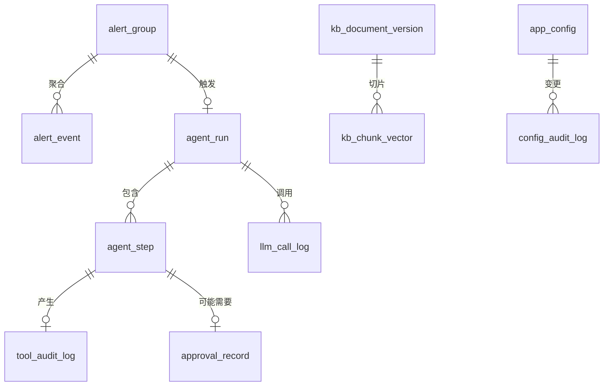

# 5. 数据库设计文档

| 项 | 内容 |
|----|------|
| 数据库 | PostgreSQL 10+ ，向量检索用 pgvector + HNSW |
| 迁移工具 | Flyway，脚本在 `db/migration/` |
| 表数量 | **11 张**，其中 2 张已落地（`V1__config_governance.sql`） |
| 关联文档 | [配置外置与前端可配置设计.md](配置外置与前端可配置设计.md)、[质量与可靠性设计.md](质量与可靠性设计.md) |

---

## 1. 表总览



| # | 表 | 用途 | 状态 | 保留期 |
|---|-----|------|------|-------|
| 1 | `app_config` | 配置覆盖值 | ✅ **已落地** | 永久 |
| 2 | `config_audit_log` | 配置变更审计 | ✅ **已落地** | 180 天 |
| 3 | `agent_run` | 一次排查的全过程 | ⬜ M2 | 90 天 |
| 4 | `agent_step` | 排查的单步 | ⬜ M2 | 90 天 |
| 5 | `tool_audit_log` | 工具调用审计 | ⬜ M2 | 180 天 |
| 6 | `approval_record` | 审批记录 | ⬜ M2 | **永久** |
| 7 | `alert_group` | 告警聚合组 | ⬜ M2 | 30 天 |
| 8 | `alert_event` | 单条原始告警 | ⬜ M2 | 30 天 |
| 9 | `kb_document_version` | 知识库文档版本 | ⬜ M4 | 永久 |
| 10 | `kb_chunk_vector` | 切片向量 | ⬜ M4 | 随文档版本 |
| 11 | `llm_call_log` | 模型调用与 token 计量 | ⬜ M3 | 30 天 |

> `approval_record` 保留期是**永久**：它是责任归属的唯一凭据。
> 出事时要能回答"这个操作是谁批的、他当时看到的是什么"。

---

## 2. 已落地：配置治理表

### 2.1 `app_config`

```sql
CREATE TABLE IF NOT EXISTS app_config (
    config_key    VARCHAR(191)   NOT NULL PRIMARY KEY,
    config_value  VARCHAR(2000),          -- NULL = 墓碑行
    revision      BIGINT         NOT NULL,
    updated_at    TIMESTAMP      NOT NULL,
    updated_by    VARCHAR(64)
);

CREATE INDEX IF NOT EXISTS idx_app_config_live
    ON app_config (config_key)
    WHERE config_value IS NOT NULL;      -- 部分索引，跳过墓碑
```

**两条不显眼但关键的约束**：

1. **只存"被改过"的键。** 默认值留在代码的 `ConfigSpec` 声明里。
   好处是"哪些参数被改离了基线"一条 SQL 就能查出来，
   而且默认值的变更走代码评审，不走数据库。

2. **恢复默认时不 `DELETE`，而是把 `config_value` 置 `NULL` 留墓碑行。**
   因为 `JdbcConfigStore.revision()` 取 `MAX(revision)`，
   **真删行会让修订号倒退**，导致 `ConfigService` 的快照缓存
   误判为"没变化"而读到旧值。
   墓碑行数量上限 = 配置项总数（当前 39），不会无限增长。

### 2.2 `config_audit_log`

```sql
CREATE TABLE IF NOT EXISTS config_audit_log (
    id            BIGINT GENERATED BY DEFAULT AS IDENTITY PRIMARY KEY,
    config_key    VARCHAR(191)   NOT NULL,
    old_value     VARCHAR(2000),
    new_value     VARCHAR(2000),          -- NULL = 这次是恢复默认
    operator      VARCHAR(64)    NOT NULL,
    reason        VARCHAR(500),
    tier          VARCHAR(32)    NOT NULL,
    changed_at    TIMESTAMP      NOT NULL
);

CREATE INDEX IF NOT EXISTS idx_config_audit_key  ON config_audit_log (config_key, changed_at);
CREATE INDEX IF NOT EXISTS idx_config_audit_time ON config_audit_log (changed_at DESC);
```

`tier` 冗余存储而不是 join 出来：审计记录必须在**配置声明被删除后依然可读**。

---

## 3. 规划：Agent 执行链

### 3.1 `agent_run`

```sql
CREATE TABLE agent_run (
    id              VARCHAR(64)  PRIMARY KEY,
    trace_id        VARCHAR(64)  NOT NULL,
    alert_group_id  VARCHAR(64),
    status          VARCHAR(32)  NOT NULL,   -- RUNNING / SUCCEEDED / FAILED / ABORTED / HANDED_OVER
    autonomy_level  VARCHAR(32)  NOT NULL,   -- 快照：当时的放权等级
    step_cursor     INT          NOT NULL DEFAULT 0,   -- ★ 断点续跑
    budget_steps    INT          NOT NULL,
    budget_tokens   BIGINT       NOT NULL,
    budget_cost     NUMERIC(12,6) NOT NULL,
    used_steps      INT          NOT NULL DEFAULT 0,
    used_tokens     BIGINT       NOT NULL DEFAULT 0,
    used_cost       NUMERIC(12,6) NOT NULL DEFAULT 0,
    created_at      TIMESTAMP    NOT NULL,
    finished_at     TIMESTAMP
);
CREATE INDEX idx_agent_run_status ON agent_run (status, created_at DESC);
CREATE INDEX idx_agent_run_trace  ON agent_run (trace_id);
```

**`step_cursor` 是这张表最重要的字段**：worker 崩溃后从 cursor 续跑，
不从头重来，也不会重复执行已完成的步骤。

`autonomy_level` 存**快照**而不是引用：放权等级会变，
但"当时是在什么授权下做的"必须固定下来。

### 3.2 `agent_step`

```sql
CREATE TABLE agent_step (
    id               VARCHAR(64)  PRIMARY KEY,
    run_id           VARCHAR(64)  NOT NULL REFERENCES agent_run(id),
    seq              INT          NOT NULL,
    tool_name        VARCHAR(191),
    args_json        TEXT,
    idempotency_key  VARCHAR(128) NOT NULL,
    status           VARCHAR(32)  NOT NULL,
    result_summary   TEXT,
    error_message    TEXT,
    started_at       TIMESTAMP    NOT NULL,
    finished_at      TIMESTAMP,
    CONSTRAINT uq_agent_step_idem UNIQUE (idempotency_key)   -- ★
);
CREATE INDEX idx_agent_step_run ON agent_step (run_id, seq);
```

> **`uq_agent_step_idem` 这个唯一约束是幂等的物理保证。**
> 应用层的 `IdempotencyStore` 在多实例下会失效——两个 worker 同时拿到同一个
> 重投消息，各自查内存都说"没执行过"。数据库唯一约束是唯一靠得住的兜底。

### 3.3 `tool_audit_log`

```sql
CREATE TABLE tool_audit_log (
    id             BIGINT GENERATED BY DEFAULT AS IDENTITY PRIMARY KEY,
    trace_id       VARCHAR(64)  NOT NULL,
    run_id         VARCHAR(64),
    step_id        VARCHAR(64),
    tool_name      VARCHAR(191) NOT NULL,
    tool_source    VARCHAR(32)  NOT NULL,   -- LOCAL / MCP
    risk_level     VARCHAR(32)  NOT NULL,
    args_masked    TEXT         NOT NULL,   -- ★ 脱敏后
    result_masked  TEXT,
    gate_outcome   VARCHAR(32)  NOT NULL,   -- PASSED / DENIED / CLAMPED / TIMED_OUT
    denied_reason  VARCHAR(500),
    operator       VARCHAR(64),
    duration_ms    INT,
    called_at      TIMESTAMP    NOT NULL
);
CREATE INDEX idx_tool_audit_trace ON tool_audit_log (trace_id, called_at);
CREATE INDEX idx_tool_audit_risk  ON tool_audit_log (risk_level, called_at DESC);
```

**存 `args_masked` 而不是原始参数**：审计表是查询频率最高的表之一，
不能成为敏感数据的第二个副本。

`gate_outcome` 让"哪道关卡拦下了它"变成可统计的——
这是判断策略配置是否合理的唯一数据来源。

### 3.4 `approval_record`

```sql
CREATE TABLE approval_record (
    id               VARCHAR(64)  PRIMARY KEY,
    trace_id         VARCHAR(64)  NOT NULL,
    run_id           VARCHAR(64),
    step_id          VARCHAR(64),
    tool_name        VARCHAR(191) NOT NULL,
    risk_level       VARCHAR(32)  NOT NULL,
    args_snapshot    TEXT         NOT NULL,  -- ★ 审批人当时看到的内容（夹紧后、脱敏后）
    decision         VARCHAR(32)  NOT NULL,  -- GRANTED / REJECTED / TIMED_OUT
    approver         VARCHAR(64),
    comment          VARCHAR(500),
    requested_at     TIMESTAMP    NOT NULL,
    decided_at       TIMESTAMP,
    CONSTRAINT chk_approval_not_self CHECK (approver IS NULL OR approver <> requester),
    requester        VARCHAR(64)  NOT NULL
);
CREATE INDEX idx_approval_run ON approval_record (run_id);
```

**`args_snapshot` 必须是夹紧后的值。** 审批人批的必须是真正会执行的东西——
如果看到的是夹紧前的值，那这次审批就是无效的。
`GuardedToolCallbackTest` 里专门有一条断言守着这一点。

`TIMED_OUT` 是一等公民而不是"没有记录"：超时升级本身就是一个需要追溯的决策。

---

## 4. 规划：告警

### 4.1 `alert_group`

```sql
CREATE TABLE alert_group (
    id             VARCHAR(64)  PRIMARY KEY,
    fingerprint    VARCHAR(128) NOT NULL,   -- 聚合指纹
    service        VARCHAR(191),
    severity       VARCHAR(32)  NOT NULL,
    status         VARCHAR(32)  NOT NULL,   -- OPEN / ACKED / RESOLVED / SUPPRESSED
    event_count    INT          NOT NULL DEFAULT 1,
    first_seen_at  TIMESTAMP    NOT NULL,
    last_seen_at   TIMESTAMP    NOT NULL,
    run_id         VARCHAR(64),
    CONSTRAINT uq_alert_group_fp UNIQUE (fingerprint, status)
);
CREATE INDEX idx_alert_group_open ON alert_group (status, last_seen_at DESC);
```

> **聚合率是这个系统的第一成本杠杆**，不是可靠性优化。
> 聚合率从 15% 恶化到 40%，月 LLM 成本涨 **2.7 倍**——
> 比模型选型调优（最多 3 倍但牺牲规划质量）的影响更大且无副作用。
> 所以 `event_count` 要能算出聚合率并作为一级监控指标：
> `aggregation_ratio = 1 - (事件数 / 原始告警数)`

### 4.2 `alert_event`

```sql
CREATE TABLE alert_event (
    id            VARCHAR(64)  PRIMARY KEY,
    group_id      VARCHAR(64)  NOT NULL REFERENCES alert_group(id),
    source        VARCHAR(64)  NOT NULL,   -- prometheus / zabbix / nightingale
    raw_payload   JSONB        NOT NULL,
    labels        JSONB,
    severity      VARCHAR(32)  NOT NULL,
    fired_at      TIMESTAMP    NOT NULL,
    received_at   TIMESTAMP    NOT NULL
);
CREATE INDEX idx_alert_event_group ON alert_event (group_id, fired_at);
CREATE INDEX idx_alert_event_labels ON alert_event USING GIN (labels);
```

`raw_payload` 保留原文：聚合规则会调整，需要能重放历史告警验证新规则。

---

## 5. 规划：知识库

### 5.1 `kb_document_version`

```sql
CREATE TABLE kb_document_version (
    id            VARCHAR(64)  PRIMARY KEY,
    doc_id        VARCHAR(191) NOT NULL,
    version       INT          NOT NULL,
    title         VARCHAR(500) NOT NULL,
    content_hash  VARCHAR(64)  NOT NULL,
    source_uri    VARCHAR(500),
    status        VARCHAR(32)  NOT NULL,   -- DRAFT / ACTIVE / RETIRED
    created_at    TIMESTAMP    NOT NULL,
    created_by    VARCHAR(64),
    CONSTRAINT uq_kb_doc_ver UNIQUE (doc_id, version)
);
CREATE INDEX idx_kb_doc_active ON kb_document_version (doc_id, status);
```

**版本化而不是覆盖**：`CitationVerifier` 要能回答"当时引用的是哪一版"。
覆盖式更新会让历史回答的引用全部失效。

### 5.2 `kb_chunk_vector`

```sql
CREATE EXTENSION IF NOT EXISTS vector;

CREATE TABLE kb_chunk_vector (
    id            VARCHAR(64)  PRIMARY KEY,   -- ★ 确定性 ID，不用 uuid_generate_v4()
    doc_id        VARCHAR(191) NOT NULL,
    doc_version   INT          NOT NULL,
    ordinal       INT          NOT NULL,
    heading_path  VARCHAR(500),
    parent_id     VARCHAR(64),                -- 父子块：子块匹配，父块给模型
    content       TEXT         NOT NULL,
    token_count   INT          NOT NULL,
    metadata      JSONB,
    embedding     vector(1024) NOT NULL,      -- ★ 维度写死，见下
    created_at    TIMESTAMP    NOT NULL
);

CREATE INDEX idx_kb_chunk_hnsw ON kb_chunk_vector
    USING HNSW (embedding vector_cosine_ops);
CREATE INDEX idx_kb_chunk_doc  ON kb_chunk_vector ((metadata->>'doc_id'));
CREATE INDEX idx_kb_chunk_parent ON kb_chunk_vector (parent_id);
```

**四条已冻结的约束，每条都有具体理由**：

| 约束 | 理由 |
|------|------|
| `vector(1024)` | `text-embedding-v4` 的默认维度。**HNSW 上限是 2000 维**，选 2048 会直接建不了索引 |
| `vector_cosine_ops` | 与 `COSINE_DISTANCE` 匹配。**写错不会报错**，会静默退化成全表扫描，表现为"突然变慢" |
| `id` **不用** `DEFAULT uuid_generate_v4()` | chunk ID 必须**确定性**：`UUID.nameUUIDFromBytes(docId\|version\|headingPath\|ordinal)`。否则重复索引会产生重复切片，且无法做版本安全的 upsert |
| `initialize-schema: false` | 交给受控迁移。为 `true` 会在建表时钉死维度，之后无法演进 |

**版本安全的 upsert = 先 delete 再 add**。
`VectorStore` 没有 upsert 语义，直接 add 会产生重复。

---

## 6. 规划：模型调用计量

### 6.1 `llm_call_log`

```sql
CREATE TABLE llm_call_log (
    id              BIGINT GENERATED BY DEFAULT AS IDENTITY PRIMARY KEY,
    trace_id        VARCHAR(64)  NOT NULL,
    run_id          VARCHAR(64),
    call_type       VARCHAR(32)  NOT NULL,   -- PLANNER / EXECUTOR / REPLANNER / REPORTER / CHAT / EMBEDDING
    model           VARCHAR(64)  NOT NULL,
    prompt_version  VARCHAR(64)  NOT NULL,   -- ★ 缺了它就无法归因
    prompt_masked   MEDIUMTEXT,              -- 脱敏后
    response_masked TEXT,
    prompt_tokens   INT          NOT NULL,
    completion_tokens INT        NOT NULL,
    total_tokens    INT          NOT NULL,
    cached_tokens   INT          NOT NULL DEFAULT 0,
    latency_ms      INT          NOT NULL,
    is_retry        BOOLEAN      NOT NULL DEFAULT FALSE,
    failover_from   VARCHAR(64),
    status          VARCHAR(32)  NOT NULL,
    called_at       TIMESTAMP    NOT NULL
);
CREATE INDEX idx_llm_run   ON llm_call_log (run_id, called_at);
CREATE INDEX idx_llm_model ON llm_call_log (model, called_at DESC);
```

**三个字段是成本模型能不能落地的关键**：

- `prompt_version` —— 没有它，"改 prompt 之后质量变了"无法归因
- `cached_tokens` —— 命中缓存的输入单价是未命中的 **1/30**
  （v4-pro 谷时 0.66 vs 0.022 USD/1M），不算这一项成本模型会严重高估
- `is_retry` / `failover_from` —— 重试的 token 成本只有 +1.4%（可忽略），
  但**重试的延迟是 +8s，直接击穿 P95**。这两个维度必须分开度量

---

## 7. 迁移策略

| 规则 |
|------|
| 一律走 Flyway，脚本命名 `V{n}__{描述}.sql`，**已发布的脚本不可修改** |
| **`initialize-schema` 全部设为 `false`**，包括 pgvector |
| 破坏性变更（改列类型、删列）必须分两步发布：先加新列双写，再切读，最后删旧列 |
| 每张表建表时就带上 `COMMENT ON`，说明**为什么这么设计**而不只是"这是什么" |
| 索引变更用 `CREATE INDEX CONCURRENTLY`，不要锁表 |

### 7.1 迁移脚本规划

| 脚本 | 内容 | 状态 |
|------|------|------|
| `V1__config_governance.sql` | `app_config` + `config_audit_log` | ✅ |
| `V2__agent_execution.sql` | `agent_run` + `agent_step` + `tool_audit_log` + `approval_record` | ⬜ M2 |
| `V3__alert.sql` | `alert_group` + `alert_event` | ⬜ M2 |
| `V4__llm_metering.sql` | `llm_call_log` | ⬜ M3 |
| `V5__knowledge_base.sql` | `kb_document_version` + `kb_chunk_vector`（需 `vector` 扩展） | ⬜ M4 |

---

## 8. 通用约定

| 项 | 约定 | 理由 |
|----|------|------|
| 主键 | 业务实体用 `VARCHAR(64)` 应用生成；日志表用 `BIGINT IDENTITY` | 业务 ID 要能跨系统传递；日志表不需要 |
| 时间 | `TIMESTAMP`（不带时区），一律存 UTC | 带时区的列在跨库迁移时行为不一致 |
| 枚举 | `VARCHAR(32)` 而不是 PG 的 `ENUM` 类型 | PG 的 ENUM **加值容易删值极难**，且迁移工具支持差 |
| JSON | `JSONB` 而不是 `JSON` | 需要建 GIN 索引 |
| 字符串主键长度 | `VARCHAR(191)` | 与 utf8mb4 的索引长度限制兼容，便于将来同步 |
| 软删除 | **只在 `app_config` 用墓碑行**，其他表不做软删除 | 墓碑行的必要性来自 `revision()` 单调性这个具体约束，不是通用偏好 |
| 脱敏 | 所有可能含敏感数据的列，列名带 `_masked` 后缀 | 让"这列是脱敏后的"在 DDL 层面就可见，不依赖注释 |
