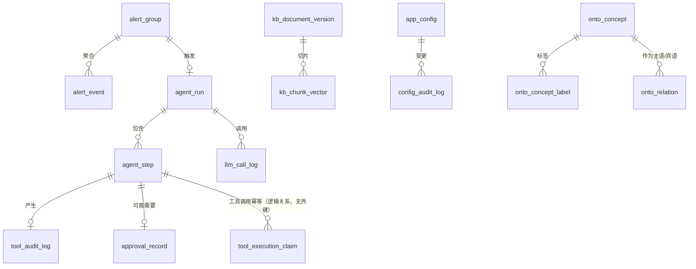

# 5. 数据库设计文档

| 项 | 内容 |
|----|------|
| 数据库 | PostgreSQL 10+ ，向量检索用 pgvector + HNSW |
| 迁移工具 | Flyway，脚本在 `db/migration/` |
| 表数量 | **16 张**（另有 3 个 `PARTITION OF … DEFAULT` 分区，`information_schema` 会一并计入 ⇒ CI 断言的是 **19**） |
| 落地状态 | **16 张表的 DDL（V1–V7）全部在真实 PostgreSQL 16 + pgvector 上执行通过，且重复执行也通过**（CI job `DDL on PostgreSQL 16 + pgvector`，run `33984843271`）。V1 的 2 张与 V7 的 1 张另有 JDBC 读写路径在 H2 上的测试 |
| 关联文档 | [配置外置与前端可配置设计.md](配置外置与前端可配置设计.md)、[质量与可靠性设计.md](质量与可靠性设计.md)、[轻量本体设计.md](轻量本体设计.md) |

> **状态标记的含义**（三种，不要混用）：
> - ✅ **DDL 已验证** — 脚本在真实 PostgreSQL 16 + pgvector 上执行通过，且重复执行也通过
> - ✅✅ **DDL 已验证 + 读写路径已测** — 上一项之外，还有 JDBC 实现在 H2 上跑过它的读写
> - ⬜ **仅设计** — 本文档里有设计，还没有脚本
>
> 引入这三种标记的经过：V2–V6 写完时**从未在任何数据库上执行过**——
> 开发沙箱里没有 PostgreSQL 也没有 psql，测试作用域只有 H2，
> 而 `PARTITION BY RANGE` 与 `vector(1024)` + HNSW 是 PostgreSQL 专有的。
> 当时全部标 🟡，然后在 CI 里加了 `pgvector/pgvector:pg16` 的 service 容器实测，
> 一次通过。**结论是：加一个数据库 service 容器比在文档里写风险清单有用得多。**

---

## 1. 表总览



| # | 表 | 用途 | 状态 | 保留期 |
|---|-----|------|------|-------|
| 1 | `app_config` | 配置覆盖值 | ✅✅ DDL + 读写路径 | 永久 |
| 2 | `config_audit_log` | 配置变更审计 | ✅✅ DDL + 读写路径 | 180 天 |
| 3 | `agent_run` | 一次排查的全过程 | ✅ DDL 已验证 | 90 天 |
| 4 | `agent_step` | 排查的单步 | ✅ DDL 已验证 | 90 天 |
| 5 | `tool_audit_log` | 工具调用审计 | ✅ DDL 已验证 | 180 天 |
| 6 | `approval_record` | 审批记录 | ✅ DDL 已验证 | **永久** |
| 7 | `alert_group` | 告警聚合组 | ✅ DDL 已验证 | 30 天 |
| 8 | `alert_event` | 单条原始告警 | ✅ DDL 已验证 | 30 天 |
| 9 | `kb_document_version` | 知识库文档版本 | ✅ DDL 已验证 | 永久 |
| 10 | `kb_chunk_vector` | 切片向量 | ✅ DDL 已验证 | 随文档版本 |
| 11 | `llm_call_log` | 模型调用与 token 计量 | ✅ DDL 已验证 | 30 天 |
| 12 | `onto_concept` | 本体概念层 | ✅ DDL 已验证 | 永久 |
| 13 | `onto_concept_label` | 概念的 pref/alt/hidden 标签 | ✅ DDL 已验证 | 永久 |
| 14 | `onto_relation` | 带类型的关系（依赖/部署/归属） | ✅ DDL 已验证 | 永久 |
| 15 | `onto_rule` | 规则开关与命中统计 | ✅ DDL 已验证 | 永久 |
| 16 | `tool_execution_claim` | 工具执行幂等账本 | ✅✅ DDL + 读写路径 | 见 §3.5 |

> `approval_record` 保留期是**永久**：它是责任归属的唯一凭据。
> 出事时要能回答"这个操作是谁批的、他当时看到的是什么"。
>
> `onto_*` 四张表保留期永久且**不做分区**：概念与关系总量在千级，
> 增长速度是「人工维护 + CMDB 同步」，不是事件流。
> 给它们加分区只会让 join 变复杂。
>
> `onto_relation` 可能长期为空——它依赖 CMDB 的依赖数据，
> 那是[已登记的信息缺口](DEVLONG.md)。为空时本体退化成受控词表，
> 概念层（12、13）的价值不受影响。

---

## 2. 已落地：配置治理表

### 2.1 `app_config`

```sql
CREATE TABLE IF NOT EXISTS app_config (
    config_key    VARCHAR(191)   NOT NULL PRIMARY KEY,
    config_value  VARCHAR(2000),          -- NULL = 墓碑行
    revision      BIGINT         NOT NULL,
    updated_at    TIMESTAMP      NOT NULL,
    updated_by    VARCHAR(64)
);

CREATE INDEX IF NOT EXISTS idx_app_config_live
    ON app_config (config_key)
    WHERE config_value IS NOT NULL;      -- 部分索引，跳过墓碑
```

**两条不显眼但关键的约束**：

1. **只存"被改过"的键。** 默认值留在代码的 `ConfigSpec` 声明里。
   好处是"哪些参数被改离了基线"一条 SQL 就能查出来，
   而且默认值的变更走代码评审，不走数据库。

2. **恢复默认时不 `DELETE`，而是把 `config_value` 置 `NULL` 留墓碑行。**
   因为 `JdbcConfigStore.revision()` 取 `MAX(revision)`，
   **真删行会让修订号倒退**，导致 `ConfigService` 的快照缓存
   误判为"没变化"而读到旧值。
   墓碑行数量上限 = 配置项总数（当前 39），不会无限增长。

### 2.2 `config_audit_log`

```sql
CREATE TABLE IF NOT EXISTS config_audit_log (
    id            BIGINT GENERATED BY DEFAULT AS IDENTITY PRIMARY KEY,
    config_key    VARCHAR(191)   NOT NULL,
    old_value     VARCHAR(2000),
    new_value     VARCHAR(2000),          -- NULL = 这次是恢复默认
    operator      VARCHAR(64)    NOT NULL,
    reason        VARCHAR(500),
    tier          VARCHAR(32)    NOT NULL,
    changed_at    TIMESTAMP      NOT NULL
);

CREATE INDEX IF NOT EXISTS idx_config_audit_key  ON config_audit_log (config_key, changed_at);
CREATE INDEX IF NOT EXISTS idx_config_audit_time ON config_audit_log (changed_at DESC);
```

`tier` 冗余存储而不是 join 出来：审计记录必须在**配置声明被删除后依然可读**。

---

## 3. Agent 执行链

### 3.1 `agent_run`

```sql
CREATE TABLE agent_run (
    id              VARCHAR(64)  PRIMARY KEY,
    trace_id        VARCHAR(64)  NOT NULL,
    alert_group_id  VARCHAR(64),
    status          VARCHAR(32)  NOT NULL,   -- RUNNING / SUCCEEDED / FAILED / ABORTED / HANDED_OVER
    autonomy_level  VARCHAR(32)  NOT NULL,   -- 快照：当时的放权等级
    step_cursor     INT          NOT NULL DEFAULT 0,   -- ★ 断点续跑
    budget_steps    INT          NOT NULL,
    budget_tokens   BIGINT       NOT NULL,
    budget_cost     NUMERIC(12,6) NOT NULL,
    used_steps      INT          NOT NULL DEFAULT 0,
    used_tokens     BIGINT       NOT NULL DEFAULT 0,
    used_cost       NUMERIC(12,6) NOT NULL DEFAULT 0,
    created_at      TIMESTAMP    NOT NULL,
    finished_at     TIMESTAMP
);
CREATE INDEX idx_agent_run_status ON agent_run (status, created_at DESC);
CREATE INDEX idx_agent_run_trace  ON agent_run (trace_id);
```

**`step_cursor` 是这张表最重要的字段**：worker 崩溃后从 cursor 续跑，
不从头重来，也不会重复执行已完成的步骤。

`autonomy_level` 存**快照**而不是引用：放权等级会变，
但"当时是在什么授权下做的"必须固定下来。

### 3.2 `agent_step`

```sql
CREATE TABLE agent_step (
    id               VARCHAR(64)  PRIMARY KEY,
    run_id           VARCHAR(64)  NOT NULL REFERENCES agent_run(id),
    seq              INT          NOT NULL,
    tool_name        VARCHAR(191),
    args_json        TEXT,
    idempotency_key  VARCHAR(128) NOT NULL,
    status           VARCHAR(32)  NOT NULL,
    result_summary   TEXT,
    error_message    TEXT,
    started_at       TIMESTAMP    NOT NULL,
    finished_at      TIMESTAMP,
    CONSTRAINT uq_agent_step_idem UNIQUE (idempotency_key)   -- ★
);
CREATE INDEX idx_agent_step_run ON agent_step (run_id, seq);
```

> **`uq_agent_step_idem` 是「步」级别的幂等保证，不是工具调用级别的。**
>
> ⚠️ 这一条原先写的是「这个唯一约束是幂等的物理保证」，**那句话是错的，已更正**：
> 这条约束的粒度是 `agent_step` 一行，而工具执行的幂等键是
> `runId|step|toolName|canonicalArgs` —— 一步之内可以有多次不同的工具调用，
> 粒度比一步细。它约束不到工具执行。
>
> 它保证的是「同一个步不会被插入两次」（消息重投 / 重试时整步重放），
> 而**工具调用的幂等物理保证在 `tool_execution_claim` 的主键上**，见 §3.5。

### 3.3 `tool_audit_log`

```sql
CREATE TABLE tool_audit_log (
    id             BIGINT GENERATED BY DEFAULT AS IDENTITY PRIMARY KEY,
    trace_id       VARCHAR(64)  NOT NULL,
    run_id         VARCHAR(64),
    step_id        VARCHAR(64),
    tool_name      VARCHAR(191) NOT NULL,
    tool_source    VARCHAR(32)  NOT NULL,   -- LOCAL / MCP
    risk_level     VARCHAR(32)  NOT NULL,
    args_masked    TEXT         NOT NULL,   -- ★ 脱敏后
    result_masked  TEXT,
    gate_outcome   VARCHAR(32)  NOT NULL,   -- PASSED / DENIED / CLAMPED / TIMED_OUT
    denied_reason  VARCHAR(500),
    operator       VARCHAR(64),
    duration_ms    INT,
    called_at      TIMESTAMP    NOT NULL
);
CREATE INDEX idx_tool_audit_trace ON tool_audit_log (trace_id, called_at);
CREATE INDEX idx_tool_audit_risk  ON tool_audit_log (risk_level, called_at DESC);
```

**存 `args_masked` 而不是原始参数**：审计表是查询频率最高的表之一，
不能成为敏感数据的第二个副本。

`gate_outcome` 让"哪道关卡拦下了它"变成可统计的——
这是判断策略配置是否合理的唯一数据来源。

### 3.4 `approval_record`

```sql
CREATE TABLE approval_record (
    id               VARCHAR(64)  PRIMARY KEY,
    trace_id         VARCHAR(64)  NOT NULL,
    run_id           VARCHAR(64),
    step_id          VARCHAR(64),
    tool_name        VARCHAR(191) NOT NULL,
    risk_level       VARCHAR(32)  NOT NULL,
    args_snapshot    TEXT         NOT NULL,  -- ★ 审批人当时看到的内容（夹紧后、脱敏后）
    decision         VARCHAR(32)  NOT NULL,  -- GRANTED / REJECTED / TIMED_OUT
    approver         VARCHAR(64),
    comment          VARCHAR(500),
    requested_at     TIMESTAMP    NOT NULL,
    decided_at       TIMESTAMP,
    CONSTRAINT chk_approval_not_self CHECK (approver IS NULL OR approver <> requester),
    requester        VARCHAR(64)  NOT NULL
);
CREATE INDEX idx_approval_run ON approval_record (run_id);
```

**`args_snapshot` 必须是夹紧后的值。** 审批人批的必须是真正会执行的东西——
如果看到的是夹紧前的值，那这次审批就是无效的。
`GuardedToolCallbackTest` 里专门有一条断言守着这一点。

`TIMED_OUT` 是一等公民而不是"没有记录"：超时升级本身就是一个需要追溯的决策。

---

### 3.5 `tool_execution_claim`

```sql
CREATE TABLE tool_execution_claim (
    idempotency_key  VARCHAR(128)  NOT NULL PRIMARY KEY,   -- ★
    tool_name        VARCHAR(191)  NOT NULL,
    state            VARCHAR(16)   NOT NULL,
    result           TEXT,
    created_at       TIMESTAMP     NOT NULL,
    updated_at       TIMESTAMP     NOT NULL,
    CONSTRAINT chk_claim_state CHECK (state IN ('CLAIMED','COMPLETED'))
);
CREATE INDEX idx_claim_stale ON tool_execution_claim (state, updated_at);
```

> **★ 幂等键就是主键，这是工具调用幂等的唯一物理保证。**
>
> `GuardedToolCallback` 的第④关用一次 `INSERT` **抢占**执行权：
> 主键冲突即表示「别人已经抢到了」。这是唯一在并发下成立的写法——
> 应用层的 `SELECT` 再 `INSERT` 之间永远有窗口，而「两个实例同时扩容」
> 正是这个窗口会造成真实事故的地方。**唯一约束在这种情况下只是探测器，
> 不是阻止器**，除非冲突发生在执行之前。
>
> **为什么是独立一张表，而不是给 `tool_audit_log` 加 `UNIQUE`**：
> 审计是只追加的事件流，一次调用可以有多条（审批 / 夹紧 / 成功或失败）；
> 幂等需要一行**可变**且失败后**可删**的记录以允许重试。
> 给审计表加唯一约束会与「一次调用多条事件」直接冲突；
> 而从只追加的审计表里删行，就是审计最不能容忍的操作。
>
> **`state` 的两个值与生命周期**：
> - `CLAIMED` — 已抢到执行权、尚未结束。此状态下 `result` 为 NULL，
>   此时另一个线程再来**必须报错**（返回 NULL 会被模型当成「执行成功了」）。
> - `COMPLETED` — 已完成，`result` 可重放。
> - 失败 / 审批被拒 / 审批超时时**删除该行**以允许重试；
>   删除必须带 `state='CLAIMED'` 条件，否则一次迟到的失败回调会删掉
>   已完成的行，成功结果丢失，下次重试真的再执行一遍。
> - 实例在 `CLAIMED` 与完成之间被 kill，那一行就是残留。
>   `idx_claim_stale` 服务清理任务：`state='CLAIMED' AND updated_at < ?`。
>
> **保留期**：`COMPLETED` 的行是重放依据，不能按固定天数删——
> 删早了，重试会真的再执行一次。建议按「幂等键的生命周期上界」保留
> （≥ 审批超时 + 最长执行时间 + 重试窗口），而不是照抄审计的 180 天。
> `CLAIMED` 的残留行由清理任务按分钟级回收。
>
> 读写路径见 `JdbcToolExecutionLedger`（只用 `javax.sql`，不用方言语法，
> 因此在 H2 上有 14 个真库测试；建表语句直接从本表的迁移脚本 V7 里抽，
> 测的是生产要执行的那份 DDL，不是类里的常量副本）。

---

## 4. 告警

### 4.1 `alert_group`

```sql
CREATE TABLE alert_group (
    id             VARCHAR(64)  PRIMARY KEY,
    fingerprint    VARCHAR(128) NOT NULL,   -- 聚合指纹
    service        VARCHAR(191),
    severity       VARCHAR(32)  NOT NULL,
    status         VARCHAR(32)  NOT NULL,   -- OPEN / ACKED / RESOLVED / SUPPRESSED
    event_count    INT          NOT NULL DEFAULT 1,
    first_seen_at  TIMESTAMP    NOT NULL,
    last_seen_at   TIMESTAMP    NOT NULL,
    run_id         VARCHAR(64),
    CONSTRAINT uq_alert_group_fp UNIQUE (fingerprint, status)
);
CREATE INDEX idx_alert_group_open ON alert_group (status, last_seen_at DESC);
```

> **聚合率是这个系统的第一成本杠杆**，不是可靠性优化。
> 聚合率从 15% 恶化到 40%，月 LLM 成本涨 **2.7 倍**——
> 比模型选型调优（最多 3 倍但牺牲规划质量）的影响更大且无副作用。
> 所以 `event_count` 要能算出聚合率并作为一级监控指标：
> `aggregation_ratio = 1 - (事件数 / 原始告警数)`

### 4.2 `alert_event`

```sql
CREATE TABLE alert_event (
    id            VARCHAR(64)  PRIMARY KEY,
    group_id      VARCHAR(64)  NOT NULL REFERENCES alert_group(id),
    source        VARCHAR(64)  NOT NULL,   -- prometheus / zabbix / nightingale
    raw_payload   JSONB        NOT NULL,
    labels        JSONB,
    severity      VARCHAR(32)  NOT NULL,
    fired_at      TIMESTAMP    NOT NULL,
    received_at   TIMESTAMP    NOT NULL
);
CREATE INDEX idx_alert_event_group ON alert_event (group_id, fired_at);
CREATE INDEX idx_alert_event_labels ON alert_event USING GIN (labels);
```

`raw_payload` 保留原文：聚合规则会调整，需要能重放历史告警验证新规则。

---

## 5. 知识库

### 5.1 `kb_document_version`

```sql
CREATE TABLE kb_document_version (
    id            VARCHAR(64)  PRIMARY KEY,
    doc_id        VARCHAR(191) NOT NULL,
    version       INT          NOT NULL,
    title         VARCHAR(500) NOT NULL,
    content_hash  VARCHAR(64)  NOT NULL,
    source_uri    VARCHAR(500),
    status        VARCHAR(32)  NOT NULL,   -- DRAFT / ACTIVE / RETIRED
    created_at    TIMESTAMP    NOT NULL,
    created_by    VARCHAR(64),
    CONSTRAINT uq_kb_doc_ver UNIQUE (doc_id, version)
);
CREATE INDEX idx_kb_doc_active ON kb_document_version (doc_id, status);
```

**版本化而不是覆盖**：`CitationVerifier` 要能回答"当时引用的是哪一版"。
覆盖式更新会让历史回答的引用全部失效。

### 5.2 `kb_chunk_vector`

```sql
CREATE EXTENSION IF NOT EXISTS vector;

CREATE TABLE kb_chunk_vector (
    id            VARCHAR(64)  PRIMARY KEY,   -- ★ 确定性 ID，不用 uuid_generate_v4()
    doc_id        VARCHAR(191) NOT NULL,
    doc_version   INT          NOT NULL,
    ordinal       INT          NOT NULL,
    heading_path  VARCHAR(500),
    parent_id     VARCHAR(64),                -- 父子块：子块匹配，父块给模型
    content       TEXT         NOT NULL,
    token_count   INT          NOT NULL,
    metadata      JSONB,
    embedding     vector(1024) NOT NULL,      -- ★ 维度写死，见下
    created_at    TIMESTAMP    NOT NULL
);

CREATE INDEX idx_kb_chunk_hnsw ON kb_chunk_vector
    USING HNSW (embedding vector_cosine_ops);
CREATE INDEX idx_kb_chunk_doc  ON kb_chunk_vector ((metadata->>'doc_id'));
CREATE INDEX idx_kb_chunk_parent ON kb_chunk_vector (parent_id);
```

**四条已冻结的约束，每条都有具体理由**：

| 约束 | 理由 |
|------|------|
| `vector(1024)` | `text-embedding-v4` 的默认维度。**HNSW 上限是 2000 维**，选 2048 会直接建不了索引 |
| `vector_cosine_ops` | 与 `COSINE_DISTANCE` 匹配。**写错不会报错**，会静默退化成全表扫描，表现为"突然变慢" |
| `id` **不用** `DEFAULT uuid_generate_v4()` | chunk ID 必须**确定性**：`UUID.nameUUIDFromBytes(docId\|version\|headingPath\|ordinal)`。否则重复索引会产生重复切片，且无法做版本安全的 upsert |
| `initialize-schema: false` | 交给受控迁移。为 `true` 会在建表时钉死维度，之后无法演进 |

**版本安全的 upsert = 先 delete 再 add**。
`VectorStore` 没有 upsert 语义，直接 add 会产生重复。

---

## 6. 模型调用计量

### 6.1 `llm_call_log`

```sql
CREATE TABLE llm_call_log (
    id              BIGINT GENERATED BY DEFAULT AS IDENTITY PRIMARY KEY,
    trace_id        VARCHAR(64)  NOT NULL,
    run_id          VARCHAR(64),
    call_type       VARCHAR(32)  NOT NULL,   -- PLANNER / EXECUTOR / REPLANNER / REPORTER / CHAT / EMBEDDING
    model           VARCHAR(64)  NOT NULL,
    prompt_version  VARCHAR(64)  NOT NULL,   -- ★ 缺了它就无法归因
    prompt_masked   MEDIUMTEXT,              -- 脱敏后
    response_masked TEXT,
    prompt_tokens   INT          NOT NULL,
    completion_tokens INT        NOT NULL,
    total_tokens    INT          NOT NULL,
    cached_tokens   INT          NOT NULL DEFAULT 0,
    latency_ms      INT          NOT NULL,
    is_retry        BOOLEAN      NOT NULL DEFAULT FALSE,
    failover_from   VARCHAR(64),
    status          VARCHAR(32)  NOT NULL,
    called_at       TIMESTAMP    NOT NULL
);
CREATE INDEX idx_llm_run   ON llm_call_log (run_id, called_at);
CREATE INDEX idx_llm_model ON llm_call_log (model, called_at DESC);
```

**三个字段是成本模型能不能落地的关键**：

- `prompt_version` —— 没有它，"改 prompt 之后质量变了"无法归因
- `cached_tokens` —— 命中缓存的输入单价是未命中的 **1/30**
  （v4-pro 谷时 0.66 vs 0.022 USD/1M），不算这一项成本模型会严重高估
- `is_retry` / `failover_from` —— 重试的 token 成本只有 +1.4%（可忽略），
  但**重试的延迟是 +8s，直接击穿 P95**。这两个维度必须分开度量

---

## 7. 本体表（轻量本体，无推理机）

对应脚本 `V6__ontology.sql`，实现见 `oncall-ontology` 模块，
方法论论证见 [本体论方法论评估.md](本体论方法论评估.md)。

### 7.1 `onto_concept` — 概念层

| 列 | 类型 | 说明 |
|----|------|------|
| `id` | `VARCHAR(64)` PK | 概念标识，形如 `service:payment-gateway` |
| `pref_label` | `VARCHAR(191)` | `skos:prefLabel` |
| `parent_id` | `VARCHAR(64)` FK→自身 | `skos:broader`（is-a） |
| `kind` | `VARCHAR(32)` + CHECK | `ALERT/SERVICE/OPERATION/REMEDIATION/DOMAIN`，**每类对应一组 Competency Question** |
| `criticality` | `VARCHAR(16)` + CHECK | `CRITICAL/HIGH/NORMAL` |
| `description` | `VARCHAR(500)` | |

**`criticality` 是属性而不是子类**，这是 OntoClean 刚性判据的直接结论：
「核心」是非刚性的——服务被提升为核心时它仍然是同一个服务。
非刚性属性不能做子类划分依据。若建成 `Service` 的子类 `CoreService`，
服务升级要改类型、迁实例，且无法表达程度。
> 这一条曾经是设计里的真实错误：同一份文档里既写了 `服务 ⊑ 核心服务`
> 又写了 `critical BOOLEAN`，两种建模并存。

### 7.2 `onto_concept_label` — 标签表

| 列 | 类型 | 说明 |
|----|------|------|
| `concept_id` | `VARCHAR(64)` FK→`onto_concept` ON DELETE CASCADE | |
| `label` | `VARCHAR(191)` | 原始写法 |
| `label_type` | `VARCHAR(16)` + CHECK | `PREF/ALT/HIDDEN` |

主键 `(concept_id, label_type, label)`。

**为什么用归一化表而不是 PostgreSQL 的 `TEXT[]`**：

| 维度 | `TEXT[]` + GIN | 归一化标签表 |
|------|----------------|--------------|
| 热路径 `WHERE label = ?` | GIN 优化的是包含运算 `@>`，等值查询用不上 | B-tree 直接命中 |
| 大小写不敏感 | 要建函数索引，方言差异点 | 多存一列 `label_norm` |
| 防重名 | 无约束 | 主键天然约束 |
| **能否用 H2 验证** | **不能**（`TEXT[]` 是 PG 专有类型） | 能 |

最后一行是决定性的：`JdbcOntologyStore` 的 SQL 若无法在 H2 上跑，
就只能用假 `Connection` 测——那是把断言写在被测代码里，等于没测。

### 7.3 `onto_relation` — 关系层

主键 `(subject, predicate, object)`。`predicate` 取值：
`depends_on` / `deployed_on` / `owned_by` / `triggers` / `remediated_by` / `requires_approval`。

`source` 区分 `CMDB` 与 `MANUAL`：同步任务会覆盖 `CMDB` 的边，不会碰 `MANUAL` 的边。

> **带类型的边是向量相似度给不了的信息。**
> 「A 依赖 B」和「A 部署在 B 上」在语义空间里几乎重合，
> 但处置方向相反——依赖关系出问题查上游，部署关系出问题查宿主机。

**遍历一律有界**：默认最多 3 跳，硬上限由 `Ontology.MAX_HOPS` 保证，
调用方传再大的数也会被夹回来。无界影响面在运维上没有意义。

### 7.4 `onto_rule` — 规则注册表

只存开关与命中计数，**规则本体在 Java**（`OntologyRule` 的实现类）。

`hit_count` 长期为 0 的规则说明它没用，应该删掉而不是留着。
规则集合不提供运行时增删接口——放权约束属于变更受控项，走审批不走热更新。

---

## 8. 迁移策略

| 规则 |
|------|
| 一律走 Flyway，脚本命名 `V{n}__{描述}.sql`，**已发布的脚本不可修改** |
| **`initialize-schema` 全部设为 `false`**，包括 pgvector |
| 破坏性变更（改列类型、删列）必须分两步发布：先加新列双写，再切读，最后删旧列 |
| 每张表建表时就带上 `COMMENT ON`，说明**为什么这么设计**而不只是"这是什么" |
| 索引变更用 `CREATE INDEX CONCURRENTLY`，不要锁表 |

### 8.1 迁移脚本规划

| 脚本 | 表数 | 内容 | 状态 |
|------|------|------|------|
| `V1__config_governance.sql` | 2 | `app_config` + `config_audit_log` | ✅ |
| `V2__agent_execution.sql` | 4 | `agent_run` + `agent_step` + `tool_audit_log` + `approval_record` | ✅ |
| `V3__alert.sql` | 2 | `alert_group` + `alert_event`（按月 RANGE 分区 + DEFAULT 兜底） | ✅ |
| `V4__llm_metering.sql` | 1 | `llm_call_log`（按月 RANGE 分区 + DEFAULT 兜底） | ✅ |
| `V5__knowledge_base.sql` | 2 | `kb_document_version` + `kb_chunk_vector`（需 `vector` 扩展） | ✅ |
| `V6__ontology.sql` | 4 | `onto_concept` + `onto_concept_label` + `onto_relation` + `onto_rule` | ✅ |
| `V7__tool_execution_claim.sql` | 1 | `tool_execution_claim`（工具调用幂等，主键即幂等键） | ✅✅ |
| | **15** | | |

M2 需要的正是 V2–V5 这 **9 张表**；V6 的 4 张是轻量本体的持久化，随 M2 一起建但不阻塞它。

### 8.2 验证结果：全部脚本在真实 PostgreSQL 上跑通

V2–V6 刚写完时**从未在任何数据库上执行过**：开发沙箱里没有 PostgreSQL 也没有 psql，
测试作用域只有 H2，而 `PARTITION BY RANGE`（V3/V4）与 `vector(1024)` + HNSW（V5）
是 PostgreSQL 专有的，H2 不支持。所以「本地跑通」这条路对它们不存在。

**做法**：在 CI 里加一个 `pgvector/pgvector:pg16` 的 service 容器，
用 `psql -v ON_ERROR_STOP=1` 按版本号顺序执行 V1–V7，然后**再执行一遍**。

**结果**（最近一次 run `33984843271`；`33979708322` 是 V1–V6 时期的那一轮）：

| 检查 | 结果 |
|------|------|
| V1–V7 首次执行 | **7/7 通过** |
| V1–V7 重复执行（幂等性） | **7/7 通过** |
| `information_schema` 表数 | **19** = 16 张逻辑表 + 3 个 DEFAULT 分区 |
| 约束断言 | **4/4 存在**：`uq_agent_step_idem`、`chk_approval_not_self`、`chk_claim_state`、`tool_execution_claim_pkey` |

> **为什么约束断言合并成一条 notice 输出**：GitHub 对单个 check run
> 每个级别最多保留 **10 条** annotation。本 job 已有 7 条 `DDL-OK` + 1 条幂等，
> 逐条发约束 notice 会被截断——run `33984843271` 就只留下了前两条，
> 后两条只能靠「没有 error 所以通过了」反推。
> **断言通过与否必须是看得见的，不能靠 absence 推断。**
> 现在输出 `DDL-约束 4/4 全部存在: …` 一条。

原来列的四个风险点**全部证伪**——`vector(1024)` + HNSW 语法、
RANGE 与 DEFAULT 分区共存、`onto_concept.parent_id` 自引用外键、
以及全部 `COMMENT ON` 的列名拼写，都是对的。

> **教训**：与其在文档里写风险清单，不如加一个数据库 service 容器。
> 风险清单只能让人「知道有风险」，service 容器能让人「知道没有风险」。
> 这个 job 现在是硬失败（第一轮曾开 `continue-on-error: true`，
> 因为当时脚本确实一次都没跑过；通过后就把开关去掉了——
> 留着它等于没有这道防线）。

---

## 9. 通用约定

| 项 | 约定 | 理由 |
|----|------|------|
| 主键 | 业务实体用 `VARCHAR(64)` 应用生成；日志表用 `BIGINT IDENTITY` | 业务 ID 要能跨系统传递；日志表不需要 |
| 时间 | `TIMESTAMP`（不带时区），一律存 UTC | 带时区的列在跨库迁移时行为不一致 |
| 枚举 | `VARCHAR(32)` 而不是 PG 的 `ENUM` 类型 | PG 的 ENUM **加值容易删值极难**，且迁移工具支持差 |
| JSON | `JSONB` 而不是 `JSON` | 需要建 GIN 索引 |
| 字符串主键长度 | `VARCHAR(191)` | 与 utf8mb4 的索引长度限制兼容，便于将来同步 |
| 软删除 | **只在 `app_config` 用墓碑行**，其他表不做软删除 | 墓碑行的必要性来自 `revision()` 单调性这个具体约束，不是通用偏好 |
| 脱敏 | 所有可能含敏感数据的列，列名带 `_masked` 后缀 | 让"这列是脱敏后的"在 DDL 层面就可见，不依赖注释 |
