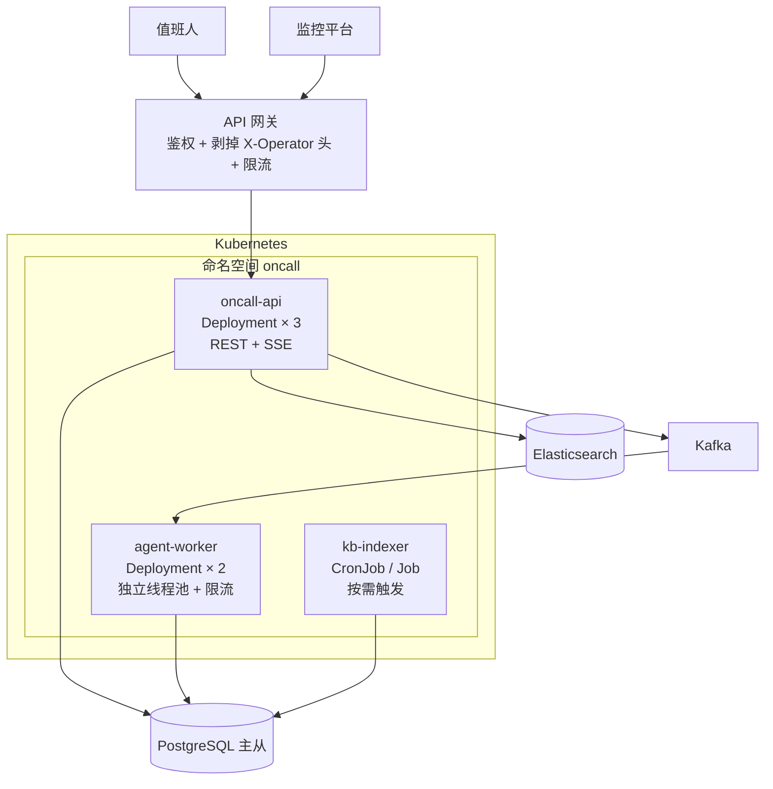

# 6. 部署文档

| 项 | 内容 |
|----|------|
| 部署形态 | 模块化单体 + 2 个可独立伸缩组件 |
| 关联文档 | [2.项目整体架构和技术栈选型分析设计文档.md](2.项目整体架构和技术栈选型分析设计文档.md)、[配置外置与前端可配置设计.md](配置外置与前端可配置设计.md) |

---

## 1. 环境划分

| 环境 | 用途 | 模型 | 数据 |
|------|------|------|------|
| `dev` | 本地与联调 | **`StubChatModel`**，不调真模型 | H2 内存库 |
| `eval` | 跑 Golden Set 回归 | 真模型，`temperature=0` 强制 | 独立库，只读生产知识库快照 |
| `shadow` | **影子模式**：接真实告警但只记录不执行 | 真模型 | 生产库只读副本 |
| `prod` | 正式 | 真模型 | 生产库 |

> **`shadow` 不是"预发环境"，是放权模型的第一级（S0）。**
> 它跑的是真实告警、真实知识库，只是**不执行任何写操作**。
> 没有这一级，从"实验室能跑"到"敢让它动生产"之间是断崖。

---

## 2. 部署拓扑



### 2.1 三个进程的职责边界

| 进程 | 职责 | 为什么必须独立 |
|------|------|--------------|
| `oncall-api` | REST + SSE + 配置管理 | 短请求，要快速响应 |
| `agent-worker` | LLM 编排、工具调用 | LLM 调用密集、长任务（目标 < 3min）、需要独立线程池与限流。**它崩溃不能影响对话服务**——否则告警风暴时连问答都不可用 |
| `kb-indexer` | 切片、向量化、入库 | 批量任务，CPU 与网络尖峰；**不能和在线服务抢资源** |

### 2.2 伸缩策略

| 进程 | 伸缩依据 |
|------|---------|
| `oncall-api` | QPS + SSE 连接数 |
| `agent-worker` | 队列积压深度。**上限受 LLM 并发配额约束**，Bulkhead 建议设为配额的 70% |
| `kb-indexer` | 不自动伸缩，批量任务手动触发 |

---

## 3. 依赖版本

| 组件 | 版本 | 说明 |
|------|------|------|
| JDK | **17** (temurin) | CI 与生产必须一致 |
| Maven | 3.9.16 | — |
| Spring Boot | 3.5.16 | 3.3.5 **已停止维护**，4.x 大版本不跟进 |
| Spring AI | 1.1.6 | 由 `spring-ai-bom` 管理 |
| Spring AI Alibaba | 1.1.2.3 | GA 线 |
| PostgreSQL | 10+ | — |
| pgvector | 支持 HNSW 的版本 | **HNSW 上限 2000 维** |
| Flyway | 与 Boot 配套 | — |

**实际解析版本由 CI 的 annotation 核对**（`AI-DEP` / `CORE-DEP` / `JACKSON-DEP`）。
不要相信 POM 里写的版本，要相信 `dependency:tree` 报出的版本。

---

## 4. 配置

### 4.1 三层配置的分工

| 层 | 放什么 | 改它需要什么 |
|----|-------|------------|
| **环境变量 / Secret** | 数据库连接串、模型 API Key、Kafka 地址 | 重新部署 |
| **`app_config` 表**（43 项） | 业务参数：阈值、超时、放权等级、检索参数 | 前端点一下（高危项需双人复核） |
| **代码里的 `ConfigSpec`** | **默认值**（被冻结的基线） | 代码评审 + 发版 |

> **冻结的是默认值，外置的是位置。** 这两件事不冲突。

### 4.2 必须走 Secret 的（`BACKEND_ONLY`）

- 数据库密码、模型 API Key、企微 Bot Secret
- 兜底机制的开关与阈值
- `vector.dimension` / `distance-type` / `index-type`（**DDL 绑定项**：
  改了不会报错，会静默退化成全表扫描）

**这三类的键名都不通过 API 暴露**——存在性本身就是信息。

### 4.3 关键环境变量

| 变量 | 说明 |
|------|------|
| `SPRING_DATASOURCE_URL` / `_USERNAME` / `_PASSWORD` | PostgreSQL |
| `DASHSCOPE_API_KEY` | 百炼 |
| `DEEPSEEK_API_KEY` | DeepSeek |
| `ONCALL_KAFKA_BOOTSTRAP` | Kafka |
| `ONCALL_PROFILE` | `dev` / `eval` / `shadow` / `prod` |
| `OTEL_EXPORTER_OTLP_ENDPOINT` | 链路追踪 |

---

## 5. 发布

### 5.1 两类变更走两条路

| 类型 | 范围 | 发布方式 |
|------|------|---------|
| **代码变更** | 逻辑、DDL、依赖 | Git → 评审 → CI → 构建 → 滚动发布 |
| **普通配置变更** | 阈值、超时、窗口、候选数 | 前端点一下，热生效 |
| **行为类配置变更** | prompt 版本、`autonomy.level`、模型选择 | **强制灰度** |

> **⚠️ 被忽略的最大发布风险**：参数外置之后，
> **影响最大的那类变更走的是管控最松的那条路径**——
> 不经过 Git、不经过评审、不经过 CI。
> 所以行为类配置必须强制灰度。

### 5.2 灰度流程

```
按 run_id 的 hash 分桶：
  阶段 1：10% 流量用新配置，观察 24h
  阶段 2：50%，观察 24h
  阶段 3：100%
```

**自动回滚条件（任一触发即回滚，不需要人工判断）**：

| 条件 | 理由 |
|------|------|
| 引用幻觉率 > 0 | 硬门槛，**一次就回滚** |
| 注入测试集通过率 < 100% | 硬门槛 |
| 答案就绪 P95 超预算 50% | 性能退化 |
| 工具拒绝率异常上升 | 策略可能被改坏 |

> **回滚条件必须是机器可判定的。**
> 如果回滚需要人开会决定，那在凌晨三点告警风暴时就不会回滚。

### 5.3 代码发布

滚动发布，`maxUnavailable=0`，`maxSurge=1`。
就绪探针必须检查：数据库连通、`ConfigRegistry` 自检通过、向量表维度匹配。

> **就绪探针检查"向量表维度匹配"是必要的**：`vector(1024)` 是建表时钉死的，
> 配置里的 `vector.dimension` 若与表不一致，检索会静默返回错误结果而不是报错。

---

## 6. 上线检查表

### 6.1 首次上线（必须全部为 ✅）

| # | 检查项 | 为什么 |
|---|-------|-------|
| 1 | **数据出域安全评审已通过** | 风险 R10。不通过整个方案要改成私有化模型 |
| 2 | 放权等级 = **S0（影子）** | 第一级不许动手 |
| 3 | kill switch 演练过，确认**热生效** | `GuardedToolCallbackTest` 有一条断言守着 |
| 4 | 注入测试集 **20/20 通过** | 硬门槛 |
| 5 | Golden Set ≥ 20 条，且跑出基线 | 没有基线就无法判断后续是否退化 |
| 6 | **网关确认剥掉客户端自带的 `X-Operator` / `X-Operator-Role` 头** | 否则前端自己填 `ADMIN` 就提权了 |
| 7 | Flyway 迁移在预发跑通，且 `initialize-schema` 全为 `false` | 为 `true` 会钉死向量维度 |
| 8 | `agent_step.idempotency_key` 的 UNIQUE 约束存在 | **多实例下应用层幂等会失效**，数据库约束是唯一兜底 |
| 9 | 审批链路演练过：批准 / 驳回 / **超时升级** | `TIMED_OUT` 是一等公民 |
| 10 | 兜底触发率监控已上线 | 没有它，兜底会静默变成主路径 |
| 11 | 成本埋点已上线（`llm_call_log`） | 成本模型里那个 15% 聚合率是**假设值** |
| 12 | MCP 自动注册已关闭（`toolcallback.enabled=false`） | **默认是 true**。开着的话运行时拉取的工具绕过所有注解式管控 |

### 6.2 每次发布

| # | 检查项 |
|---|-------|
| 1 | CI 全绿，且 `测试总数 > 0`（不接受空跑） |
| 2 | `AI-DEP` / `CORE-DEP` 报出的版本与上次一致，或差异已知 |
| 3 | 行为类配置变更走灰度，不走直接发布 |
| 4 | prompt 有变更时，L3 回归**同时跑对照组**（区分"我改坏了"和"模型漂移了"） |
| 5 | 回滚方案已确认：镜像 tag + 配置版本 + DDL 是否可回退 |

---

## 7. 运维手册要点

### 7.1 紧急情况：一键停止

```
PUT /api/config/items/autonomy.kill-switch-mode   {"value":"OFF","reason":"…"}
```

这是**高危项，需要双人复核**——但 kill switch 的语义要求它必须快。
所以约定：**`OFF` 方向（收紧）不需要复核，`FULL` 方向（放开）才需要**。
收紧永远是安全的。

### 7.2 常见故障与处置

| 现象 | 可能原因 | 处置 |
|------|---------|------|
| 检索突然变慢，不报错 | `distance-type` 与索引 `vector_cosine_ops` 不匹配，退化成全表扫描 | 核对配置与索引定义 |
| 回答质量下降，无报错 | `rerank-enabled` 被关掉了 | 查 `config_audit_log` |
| 成本突然上涨 | 聚合率恶化 | 查 `alert_group.event_count`，这是第一杠杆 |
| 同一操作执行了两次 | `idempotency_key` 唯一约束缺失 | 检查 DDL |
| 配置改了不生效 | `revision` 倒退导致快照缓存误判 | 检查 `app_config` 是否有真删行（应该只有墓碑行） |

### 7.3 数据保留

| 表 | 保留期 | 清理方式 |
|----|-------|---------|
| `alert_event` / `alert_group` | 30 天 | 分区 + `DROP PARTITION` |
| `llm_call_log` | 30 天 | 分区 |
| `agent_run` / `agent_step` | 90 天 | 分区 |
| `tool_audit_log` / `config_audit_log` | 180 天 | 归档到冷存储 |
| `approval_record` | **永久** | 不清理——它是责任归属的唯一凭据 |
| `kb_document_version` | 永久 | 不清理——历史回答的引用要能追溯 |

> 大表一律**按时间分区**，清理用 `DROP PARTITION` 而不是 `DELETE`。
> `DELETE` 会产生大量死元组并触发 VACUUM 压力。
