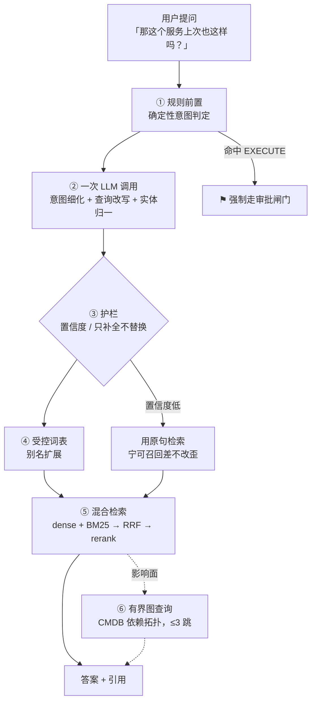

# 查询理解与知识表示设计

> 回答一个具体问题：**系统怎么理解用户在问什么？**
> 是指代消解 + 意图识别？知识库？知识图谱？还是 Ontology？
>
> 核查结论：这四样里**只有"查询改写"在文档中存在**（`修复方案.md:735` 一行注释），
> 意图识别、显式指代消解、知识图谱、Ontology 全部 **0 命中**（已 grep 确认）。
> 本文补齐这一块。
>
> ---
>
> **落地状态（本文是设计文档，不是实现说明；实现见 `DEVELOPMENT.md §1.12`）**
>
> | 本文小节 | 状态 |
> |---------|------|
> | §1.1 规则前置（`EXECUTE` 确定性判定） | ✅ 已实现，`IntentClassifier.EXECUTE_INTENT` |
> | §1.2 意图闭集（7 类） | ✅ 已实现，`Intent` 枚举 |
> | §1.3 查询改写 + 护栏 1/2/3 | 🟡 护栏 2、3 已实现；护栏 1（回显 UI）待前端；护栏 4（原句+改写句并集检索）属检索层，未实现 |
> | §1.4 受控词表 | ⬜ 未实现 |
> | §1.5 混合检索 / rerank | ⬜ 未实现 |
> | §2 一次调用做三件事 | ✅ 已实现，prompt `intent-classify.v1` |
> | §3 配置项 | 🟡 6 项中已落 2 项，见下表 |
> | §4 验收指标 | ⬜ 需要 `oncall-eval` 与标注集，未实现 |

---

## 0. 结论先行

| 手段 | 要不要 | 理由 |
|------|-------|------|
| **意图识别** | ✅ 要，但**闭集 + 规则前置** | 路由需要它；但安全相关的分类不能交给概率 |
| **指代消解** | ✅ 要，但**作为查询改写的副产品**，不单独做 | 单独做需要专门模型与标注，投入产出比差 |
| **术语归一（受控词表）** | ✅ **必须做，且优先级最高** | BM25 召回质量完全取决于术语命中。这是投入最小、收益最大的一项 |
| **有界图查询（CMDB 拓扑）** | ✅ 要，但**不是知识图谱项目** | 只查 CMDB 已有的依赖关系，3 跳以内，不需要图数据库 |
| **通用知识图谱** | ❌ v1 不做 | 见 §5 的三个具体理由与 §6 的触发条件 |
| **轻量本体（概念层 + 带类型关系 + 规则集）** | ✅ **要做** | **本文 §5 对 Ontology 的否定是错的，已被 [轻量本体设计.md](轻量本体设计.md) 修正** |

> **⚠️ 修正说明**：本文 §5 把「Ontology」等同于「OWL + 推理机那套重型语义网栈」
> 并加以否定，那部分论证成立，但由此推出「不要 Ontology」是**过度否定**。
> 轻量本体（无推理机、无 OWL）恰恰是本项目缺的东西，
> 而且它带来的查询理解收益是别名表给不了的。
> **本文 §0、§1.4、§5 中关于 Ontology 的结论以 [轻量本体设计.md](轻量本体设计.md) 为准。**

---

## 1. 分层设计



### 1.1 ① 规则前置：安全相关的分类必须是确定性的

**这是本设计最重要的一条。**

不要用 LLM 作为意图识别的唯一步骤。安全相关的判定——
特别是"这个请求要不要走审批闸门"——**必须是确定性的**：

```java
// 规则层：显式的操作类意图，正则/关键词命中即确定
// 把「要不要走审批」交给 LLM 分类，等于把安全边界交给概率
private static final Pattern EXECUTE_INTENT = Pattern.compile(
    "(重启|扩容|缩容|回滚|下线|切流|删除|清理|执行).{0,20}(服务|实例|pod|副本|节点)?");
```

命中 → 直接进 `EXECUTE` 通道 → **无条件走 `GuardedToolCallback` 的审批关卡**。

> **即使 LLM 后面把它分类成别的意图，闸门依然是兜底。**
> 这是关键的设计分工：**LLM 的分类是"路由决策"，不是"安全决策"**。
> 安全在闸门里，不在分类器里。

### 1.2 ② 意图闭集

OnCall 的意图是**有限且可枚举的**。用闭集，不用开放集：

| 意图 | 路由 | 是否可自动 |
|------|------|----------|
| `EXPLAIN_ALERT` 解释这条告警 | RAG + 告警上下文 | 只读，可 |
| `QUERY_HISTORY` 查历史相似故障 | 向量检索 + 工单库 | 只读，可 |
| `DIAGNOSE` 发起排查 | Plan-Execute-Replan，**异步 202** | 受放权等级约束 |
| `EXECUTE` 请求执行操作 | **强制审批闸门** | 受放权等级 + kill switch 约束 |
| `CONFIGURE` 改配置 | 转配置 API，**不走对话** | 走双人复核 |
| `OUT_OF_SCOPE` 超出能力范围 | **拒绝** | — |
| `CHITCHAT` 闲聊 | 极简回应或拒绝 | — |

> **`OUT_OF_SCOPE` 是最重要的意图。** 因为拒答率是**双侧指标**（目标 5–25%）：
> 太低说明什么都答（幻觉风险高），太高说明系统没用。
> 一个只会"尽力回答"的系统在运维场景是危险的。

**`CONFIGURE` 必须转出对话通道**：改配置是一次操作而不是聊天，
它需要审计、边界校验、高危项双人复核。让它在对话里发生就绕过了这些。

### 1.3 ③ 查询改写：指代消解是副产品，不单独做

单独做指代消解需要专门的模型和标注数据。
正确做法是**让查询改写一次性输出自包含的查询**，指代消解自然包含在内：

```json
// 输入：历史对话（最近 N 轮）+ 当前问题「那这个服务上次也这样吗？」
// 输出：结构化
{
  "standaloneQuery": "payment-api 服务历史上是否出现过 CPU 使用率持续超过 90% 的情况",
  "rewritten": true,
  "resolvedEntities": [
    { "text": "这个服务", "resolvedTo": "payment-api", "source": "turn-2" }
  ],
  "confidence": 0.86
}
```

**四条护栏**（因为「查询改写把原意改歪」是已登记的故障点 F3）：

| # | 护栏 | 理由 |
|---|------|------|
| 1 | `resolvedEntities` **必须回显到 UI**："我理解你问的是 payment-api" | 让用户能一眼发现并纠正。这是成本最低的防错手段 |
| 2 | `confidence < 阈值` 时**不改写**，直接用原句检索 | 宁可召回差，不要改歪。改歪的代价是答非所问，用户还看不出来 |
| 3 | **只允许"补全"，不允许"替换"**——原句里的实体不能被换成别的 | 这条能挡住绝大多数改歪 |
| 4 | 检索时**同时用原句和改写句**，结果取并集 | 成本只多一次 embedding（约 50 token），却能兜住改写失败 |

第 3、4 条是实质性防护。**只做第 1、2 条是不够的**——
第 1 条依赖用户会看，第 2 条依赖置信度可信。

### 1.4 ④ 受控词表：优先级最高的一项

**这是投入最小、收益最大的一项，但文档里完全没有。**

BM25 的召回质量**完全取决于术语命中**。用户说"支付挂了"，
文档里写的是"payment-api 服务不可用"——没有别名表就是**零召回**。

需要的只是一张**扁平的别名表**，几百到几千条：

```
payment-api  →  [支付服务, pay-svc, 支付网关, payment]
OOMKilled    →  [内存溢出, oom, 内存不足被杀]
CPU 使用率   →  [cpu, cpu_usage, CPU 占用]
```

用法：

- **查询扩展**：检索前把别名一起塞进 BM25 查询
- **prompt 注入**：让模型知道"支付服务 = payment-api"
- **数据来源**：人工维护 + **从 CMDB 自动同步服务名**

> **这不是三元组、不是推理、不是 OWL。** 就是一张表。
> 维护成本是"加一行"；Ontology 的维护成本是"招一个知识工程师"。

### 1.5 ⑤ 混合检索（已设计，此处不重复）

dense + BM25 → **RRF（k=60，候选 20）** → rerank → top-5。
见 [质量与可靠性设计.md](质量与可靠性设计.md) §2.3。

**注意**：RRF 在应用层做，不依赖引擎支持——Spring AI **没有内置 hybrid search**
（issue #6524 仍开放）。

### 1.6 ⑥ 有界图查询：唯一真正需要图结构的地方

**"这个服务挂了会影响谁"** 这类影响面分析，需要 CMDB 的服务依赖拓扑。

但要做三个判断：

| 判断 | 结论 |
|------|------|
| 这是知识图谱项目吗？ | **不是。** CMDB 里已经有这个数据（如果有），我们只是**查它**，不建它 |
| 需要图数据库吗？ | **不需要。** 3 跳以内的遍历，SQL 递归 CTE 或应用层 BFS 就够 |
| 查询是无界的吗？ | **必须有界。** 从故障服务出发，**最多 3 跳**，只沿"依赖"边，只取服务名与依赖类型 |

```sql
-- 有界依赖遍历，PostgreSQL 递归 CTE，不需要图数据库
WITH RECURSIVE deps AS (
    SELECT service, 0 AS hop FROM service_dependency WHERE service = $1
    UNION ALL
    SELECT d.upstream, deps.hop + 1
    FROM service_dependency d JOIN deps ON d.service = deps.service
    WHERE deps.hop < 3                       -- ★ 硬上限
)
SELECT DISTINCT service, hop FROM deps;
```

> **⚠️ 但这件事现在做不了。**
> [DEVLONG.md](DEVLONG.md) §9 已登记为未解决的信息缺口：
> **"CMDB 的告警→服务映射"**——没有这个映射就无法自动定位影响面，也无法 @ 对人。
> **所以问题不是"要不要上知识图谱"，而是"CMDB 里到底有没有这个数据"。**
> 这要在 M5 之前问清楚，不是技术问题。

---

## 2. 一次调用做完三件事（成本与延迟优化）

意图细化、查询改写、实体归一**应该合并成一次 LLM 调用**：

| 方案 | 调用数 | 延迟 | 成本 |
|------|-------|------|------|
| 分开做 | 3 次 Flash | ~2,400ms | 3× |
| **合并** | **1 次 Flash** | **~800ms** | 1× |

`可行性优化与拓展设计.md` §6.1 给查询改写的预算是 **800ms**，
这个数字只有在合并时才成立。

**这不违反 §1.1**：因为 `EXECUTE` 的判定在规则层已经确定性地做完了，
LLM 这次调用只做路由细化，不做安全决策。

---

## 3. 需要新增的配置项

| 键 | 类型 | 默认 | 层级 | 状态 | 说明 |
|----|------|------|------|------|------|
| `query.rewrite-enabled` | BOOLEAN | `true` | RUNTIME_HOT | ✅ 已落 | 关掉则始终用原句检索 |
| `query.rewrite-min-confidence` | DOUBLE | `0.7` | RUNTIME_HOT | ✅ 已落 | 低于此值不改写，边界 `[0,1]` |
| `query.use-original-and-rewritten` | BOOLEAN | `true` | RUNTIME_HOT | ⬜ 属检索层 | 护栏 4，**建议不要关** |
| `query.memory-turns-for-rewrite` | INT | `3` | RUNTIME_HOT | ⬜ 属会话层 | 改写时看几轮历史，边界 `[1,6]` |
| `query.expansion-max-aliases` | INT | `5` | RUNTIME_HOT | ⬜ 属受控词表 | 别名扩展上限，防止查询被稀释 |
| `graph.max-hop` | INT | `3` | RUNTIME_HOT | ⬜ 属 CMDB 图查询 | 影响面遍历上限，边界 `[1,3]`，**上界必须 ≤3** |

> **后 4 项刻意没有提前声明。** 本项目的一条硬规矩是
> **「不许声明没有读取者的配置项」**——运维改了它却什么都不发生，
> 比一个写死的常量更糟。这 4 项各自属于还没开工的组件，
> 等那个组件落地时和它的读取者一起加。

`query.rewrite-min-confidence` 是**高危项候选**：调低会让"改歪的查询"更容易通过，
表现为"回答变差"而不是报错，属于最难发现的那类退化。

---

## 4. 验收指标

| 指标 | 计算 | 门槛 |
|------|------|------|
| **意图识别准确率** | 人工标注 100 条测试集 | ≥ 0.95 |
| **`EXECUTE` 意图的召回率** | 漏判 = 该走审批的没走 | **= 1.0（硬门槛）** |
| 指代消解准确率 | 多轮对话测试集 | ≥ 0.90 |
| **改写导致的召回下降率** | 改写后 Recall@5 低于原句的比例 | ≤ 5% |
| 别名表覆盖率 | 测试查询中能命中别名的比例 | ≥ 0.80 |
| 拒答率 | `OUT_OF_SCOPE` / 总请求 | **5–25%（双侧）** |

**`EXECUTE` 召回率 = 1.0 是硬门槛**：漏判一次就意味着一个高危操作绕过了审批。
这条比意图识别的整体准确率重要得多——**分类器的错误代价是不对称的**。

---

## 5. 为什么不做通用知识图谱 / Ontology

三个具体理由，不是"以后再说"：

**① OnCall 的知识 90% 是过程性的，不是关系性的。**
Runbook 讲的是"怎么操作"，不是"实体之间什么关系"。
过程性知识用向量检索 + 结构化引用就够了；
Ontology 擅长的是关系推理，**在这个场景里用不上**。

**② Ontology 的维护成本会杀死项目。**
需要有人持续维护概念、关系、约束。OnCall 团队**没有这个角色**。
半年后 Ontology 就会和现实脱节，而**过期的 Ontology 比没有更糟**——
它会给模型错误的强约束，且因为"看起来权威"而更难被质疑。

**③ 它和 RAG 的收益重叠。**
你已经有了向量检索 + 别名表 + CMDB 拓扑。
Ontology 能多带来的那部分（复杂关系推理）在 OnCall 场景里出现频率极低。

> **一句话**：需要的是**一张别名表 + 一次有界图查询**，
> 不是一个知识表示体系。把工程投入放在这两件事上，收益比 Ontology 高一个数量级。

---

## 6. 什么情况下才值得上知识图谱

给出**可判定的触发条件**，而不是"以后再看"：

| 条件 | 阈值 | 怎么测 |
|------|------|-------|
| 多跳因果链类问题占比 | > 20% | 对真实提问做意图统计（M6 之后有数据） |
| 根因定位需要跨服务依赖推理 | > 5 个服务 | 统计 `graph.max-hop=3` 不够用的比例 |
| 有专职知识工程角色 | 有 | 组织判断 |

**三条同时满足才启动。** 只满足一两条时，扩展别名表和放宽 hop 上限更划算。

---

## 7. 落地清单

| # | 动作 | 模块 | 阶段 |
|---|------|------|------|
| 1 | `IntentClassifier`（规则前置 + LLM 细化） | `oncall-agent` | M3 |
| 2 | `QueryRewriter` + 四条护栏 | `oncall-agent` | M3 |
| 3 | **`ServiceAliasTable`（受控词表）** | `oncall-knowledge` | **M4，优先级最高** |
| 4 | 查询扩展接入 BM25 | `oncall-knowledge` | M4 |
| 5 | `CmdbTopologyPort` + 有界遍历 | `oncall-agent` | M5，**依赖 CMDB 数据确认** |
| 6 | 6 个新配置项入 `OnCallConfigRegistry` | `oncall-config` | M3 |
| 7 | 意图测试集 100 条（含 `EXECUTE` 漏判专项） | `oncall-eval` | M6 |

**第 3 项应该提前到 M4 的最开始**——它是召回质量的地基，
而且不需要任何新依赖，一张表加一个加载器就能上线。
