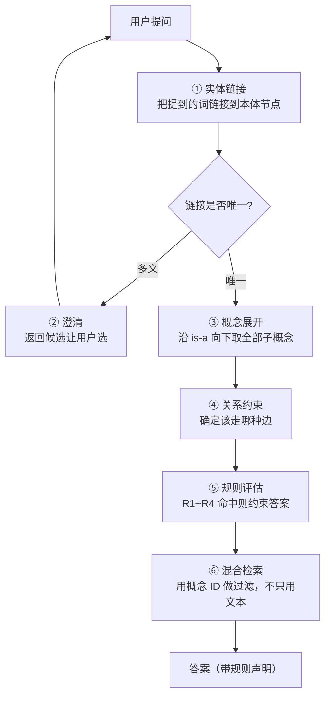

# 轻量本体（Lightweight Ontology）设计 —— 对上一版结论的修正

> **先说结论：上一份《查询理解与知识表示设计》对 Ontology 的否定是错的，
> 或者说是偷换了概念。**
>
> 我把「Ontology」等同于「OWL + 描述逻辑推理机 + SPARQL 那套重型语义网栈」，
> 然后论证了那套东西不适合本项目——**那部分论证成立**。
> 但由此推出「不要 Ontology」是过度否定。
>
> Ontology 作为**一套成体系的知识与业务规则建模方法论**，
> 恰恰是这个项目缺的东西，而且**它带来的查询理解收益是别名表给不了的**。
> 本文重新分层，并给出可落地的设计。

---

## 1. 三个层次，别混为一谈

| 层次 | 是什么 | 要不要 |
|------|-------|-------|
| **L0 受控词表** | 扁平别名表，`payment-api = 支付服务 = pay-svc` | ✅ 要，但**只解决词法匹配** |
| **L1 轻量本体** | 概念层级（is-a）+ **带类型的关系** + 显式规则集。**无推理机、无 OWL** | ✅ **要。这是本项目该做的那一层** |
| **L2 完整本体** | OWL DL + 推理机 + SHACL/SWRL 规则 + SPARQL 查询 | ❌ v1 不做（触发条件见 §7） |

**我上一版把 L1 和 L2 当成一回事否掉了。这是错误的根源。**

L1 的成本是"3 张表 + 一个有界遍历 + 一组 Java 规则"，
L2 的成本是"招一个知识工程师 + 一套语义网技术栈 + 持续的模型维护"。
**它们的收益差距远小于成本差距。**

---

## 2. 为什么 L1 的收益是 L0 给不了的

别名表解决的是**"用户说的词和文档里的词不一样"**。
它解决不了下面这四类问题，而这四类在 OnCall 里天天出现：

### 2.1 概念泛化：别名表只能一对一，本体能一对多

> 用户问：「**支付相关**的服务最近有什么异常？」

- **L0 别名表**：`支付 → payment-api`。**漏掉** `payment-gateway`、`payment-worker`、`pay-batch`。
- **L1 本体**：`支付` 链接到**业务域节点**，向下展开为该域下的全部服务。

差别不是"多召回几条"，是**问题的答案根本不同**。

### 2.2 类别推理：「这类问题」需要 is-a 关系

> 用户问：「**这类问题**以前怎么处理的？」

"这类"指的是**告警类别**，这是一个 is-a 关系：
`CPU 使用率持续 > 90%` ⊑ `资源类告警` ⊑ `告警`。

纯向量检索会用**文本相似度**去找"像的"，
但"像的"和"同类的"不是一回事——
一段讲"内存泄漏导致 CPU 飙升"的文档在向量空间里很近，
**处置方式却完全不同**。

**本体让你能用类别做检索过滤**，而不只是靠相似度排序。

### 2.3 关系类型：向量相似度会把不同关系混在一起

> 「A 依赖 B」和「A 部署在 B 上」

这两种关系的**处置方式完全相反**：
依赖关系出问题要查上游，部署关系出问题要查宿主机。

向量检索**无法区分**——两句话在语义空间里几乎重合。
带类型的关系边可以。

### 2.4 业务规则：写在代码里的规则是隐形的

> 「核心服务的高危操作需要两人审批，非核心只需一人」

如果这写成 Java 里的 `if`，它就是**隐形的、不可评审的、改起来没人知道的**。
挂在本体概念上（`服务 ⊑ 核心服务`），它变成一条**可读、可测、可审计**的规则。

**这一点对 OnCall 尤其重要**：审批策略是安全边界，
安全边界必须能被安全评审看懂，不能藏在代码分支里。

---

## 3. L1 的具体设计

### 3.1 概念层（可人工编写，不依赖外部数据）

```
告警 Alert
  ├─ 资源类 ResourceAlert
  │    ├─ CPU / 内存 / 磁盘 / 网络
  ├─ 应用类 ApplicationAlert
  │    ├─ 错误率 / 延迟 / 可用性
  └─ 业务类 BusinessAlert

服务 Service
  ├─ 核心服务 CoreService          ← 审批与放权规则挂在这里
  └─ 非核心服务

操作 Operation
  ├─ 只读操作 ReadOnly
  ├─ 可逆操作 Reversible
  └─ 不可逆操作 Irreversible       ← 审批规则挂在这里

处置 Remediation
  └─ Runbook
```

**这一层可以现在就做**：纯人工编写，几十到一两百个概念，不需要 CMDB，
不需要任何新依赖。**它直接改善查询理解。**

### 3.2 关系层（依赖外部数据，需先确认）

| 关系 | 方向 | 用途 | 数据来源 |
|------|------|------|---------|
| `depends_on` | 服务 → 服务 | **影响面分析** | CMDB（**待确认**） |
| `deployed_on` | 服务 → 节点/集群 | 定位宿主机 | CMDB（待确认） |
| `owned_by` | 服务 → 团队 | **@ 对的人** | CMDB（待确认） |
| `triggers` | 告警 → 服务 | 告警定位 | 告警标签 + CMDB |
| `remediated_by` | 告警类别 → Runbook | 检索过滤 | **人工编写** |
| `requires_approval` | 操作 → 审批级别 | 安全规则 | **人工编写** |

> **⚠️ 这一层的价值完全取决于 CMDB 里到底有没有数据。**
> [DEVLONG.md](DEVLONG.md) §9 已登记为未解决的信息缺口。
> **如果 CMDB 没有依赖关系，关系层就是空的，本体就退化成 L0 别名表。**
>
> 所以：**概念层现在做，关系层等 CMDB 确认后再做。** 这是有意的拆分。

### 3.3 规则层：Java 实现，不是规则引擎

```java
public interface OntologyRule {
    String id();                                    // 可审计、可测试
    String description();                           // 给安全评审看
    Optional<RuleEffect> evaluate(OntologyContext ctx);
}
```

**四条初始规则**：

| ID | 规则 | 效果 |
|----|------|------|
| `R1` | 操作 ⊑ `不可逆操作` | 必须双人审批 |
| `R2` | 服务 ⊑ `核心服务` ∧ 操作风险 = HIGH | 必须两人审批（而非一人） |
| `R3` | 告警 ∈ `资源类` ∧ 服务 ⊑ `核心服务` | **放权上限 = S1**（不允许自动执行） |
| `R4` | Runbook 最后更新 > 180 天 | 回答时**必须声明"该手册可能过期"** |

**为什么用 Java 而不是 SWRL / Drools**：

| 理由 | 说明 |
|------|------|
| 必须可测试 | 每条规则一个 JUnit 用例，规则改动会被测试拦住 |
| 必须可评审 | 安全评审要能读懂规则。SWRL 对非专业人员是天书 |
| 必须响亮地失败 | 规则引擎的常见故障模式是"静默不匹配"，规则悄悄不生效 |
| 规则数量少 | 初期 4 条，一年内不会超过 30 条。**这个规模用不着规则引擎** |

> **规则数量超过 50 条、或需要非开发人员维护时，才考虑规则引擎。**
> 在那之前，引入规则引擎只是增加一个会静默失效的组件。

### 3.4 存储：3 张表，不需要图数据库

```sql
CREATE TABLE onto_concept (
    id          VARCHAR(64)  PRIMARY KEY,
    label       VARCHAR(191) NOT NULL,
    parent_id   VARCHAR(64)  REFERENCES onto_concept(id),   -- is-a
    kind        VARCHAR(32)  NOT NULL,      -- ALERT / SERVICE / OPERATION / REMEDIATION
    critical    BOOLEAN      NOT NULL DEFAULT FALSE,
    aliases     TEXT[]       NOT NULL DEFAULT '{}',          -- ★ 别名内嵌，L0 被吸收进 L1
    description VARCHAR(500)
);
CREATE INDEX idx_onto_concept_parent ON onto_concept (parent_id);
CREATE INDEX idx_onto_concept_aliases ON onto_concept USING GIN (aliases);

CREATE TABLE onto_relation (
    subject     VARCHAR(64)  NOT NULL,
    predicate   VARCHAR(64)  NOT NULL,      -- depends_on / deployed_on / owned_by / …
    object      VARCHAR(64)  NOT NULL,
    source      VARCHAR(64)  NOT NULL,      -- CMDB / MANUAL，用于判断可信度
    updated_at  TIMESTAMP    NOT NULL,
    PRIMARY KEY (subject, predicate, object)
);
CREATE INDEX idx_onto_rel_subj ON onto_relation (subject, predicate);
CREATE INDEX idx_onto_rel_obj  ON onto_relation (object, predicate);

CREATE TABLE onto_rule (
    id          VARCHAR(64)  PRIMARY KEY,   -- 与 OntologyRule.id() 对应
    enabled     BOOLEAN      NOT NULL,
    description VARCHAR(500) NOT NULL,
    hit_count   BIGINT       NOT NULL DEFAULT 0    -- ★ 没命中的规则说明它没用
);
```

**遍历用递归 CTE，硬上限 3 跳**（与上一版一致）：

```sql
WITH RECURSIVE sub AS (
    SELECT id, 0 AS depth FROM onto_concept WHERE id = $1
    UNION ALL
    SELECT c.id, sub.depth + 1
    FROM onto_concept c JOIN sub ON c.parent_id = sub.id
    WHERE sub.depth < 3
)
SELECT id FROM sub;
```

**注意 `aliases` 直接内嵌在概念表里**——L0 别名表被 L1 吸收了，
不是两套东西并存。这是分层带来的简化。

---

## 4. 它怎么改善查询理解（回答你的第 1 问）

这才是关键。本体不是挂在旁边的知识库，它**嵌进查询理解流水线**：



**五个具体的改善点**：

| # | 改善 | 没有本体会怎样 |
|---|------|--------------|
| 1 | **实体链接到概念节点**（可能是域，不是单个服务） | "支付"只能映射到一个字符串，漏掉同域其他服务 |
| 2 | **多义时返回澄清问题**，不猜 | 猜错了用户看不出来，答案看起来合理但是错的 |
| 3 | **用概念 ID 做检索过滤**，而不只靠文本相似度 | 向量检索会召回"语义像但类别不同"的文档 |
| 4 | **按关系类型遍历**（问下游只走 `depends_on`） | 依赖关系和部署关系被混在一起，处置方向相反 |
| 5 | **规则命中时约束答案**（R4：手册可能过期） | 系统会自信地引用一份两年前的 Runbook |

**第 2 点值得单独强调**：一个会问"你说的是支付网关还是支付批处理？"的系统，
比一个猜一个然后自信作答的系统**安全得多**。
而"知道自己不知道"这件事，**别名表给不了，只有概念模型能给**。

---

## 5. 与已有设计的关系

| 已有 | 本体接入后 |
|------|----------|
| `ServiceAliasTable`（上一版建议的别名表） | **被 `onto_concept.aliases` 吸收**，不再是独立组件 |
| `GuardedToolCallback` 的风险分级 | `requires_approval` 关系 + R1/R2 规则成为它的**输入**，而不是散落在注解里 |
| `AutonomyGate` 放权闸门 | R3 规则给出"这类告警 + 这类服务"的放权上限 |
| 混合检索 | 增加概念 ID 过滤维度（`metadata->>'concept_id'`） |
| `CitationVerifier` | R4 命中时，答案必须带过期声明——这是一条新的硬门槛 |

**注意第二条**：现在工具的风险等级写在注解里（`@RiskLevel`），
这对 MCP 工具无效（运行时才拉取，注解看不见）。
**把风险等级搬到本体上，是解决 MCP 管控问题的正确路径**——
因为本体是按工具名查询的，不依赖编译期注解。

这一点我上一版完全没想到，**它让本体从"锦上添花"变成了"堵住一个 P0 缺口的必要手段"**。

---

## 6. 成本与拆分

| 部分 | 工作量 | 依赖 | 何时做 |
|------|-------|------|-------|
| 概念层（人工编写 100~200 个概念） | 3~5 天 | 无 | **M4 开始** |
| 存储 + 有界遍历 + 实体链接 | 1 周 | 无 | M4 |
| 规则层 4 条 + 测试 | 3 天 | 无 | M4 |
| 接入查询理解流水线 | 1 周 | 上面三项 | M4 |
| **关系层** | 1 周 | **CMDB 数据确认** | **M5，且必须先确认数据** |
| 工具风险等级迁移到本体 | 1 周 | 概念层 | M3/M4 |

**合计约 4 周**，其中关系层可以推迟。

**不要一次性全做。** 概念层就能拿到 §4 里第 1、2、3、5 项收益，
关系层只影响第 4 项。**先做能独立产生价值的部分。**

---

## 7. L2（完整本体 + 推理机）的启动条件

给出可判定的条件，不是"以后再说"：

| 条件 | 阈值 | 怎么测 |
|------|------|-------|
| 规则数量 | > 50 条 | `onto_rule` 计数 |
| 需要非开发人员维护规则 | 是 | 组织判断 |
| 需要多跳关系推理（>3 跳） | 有真实需求 | 统计 `graph.max-hop=3` 不够用的比例 |
| 有专职知识工程角色 | 有 | 组织判断 |

**满足前两条 → 引入规则引擎（Drools / Easy Rules）。**
**满足后两条 → 才考虑 OWL + 推理机。**

**不要一步跳到 L2。** 从 L1 到 L2 的迁移成本很高，
而 L1 到规则引擎的迁移成本很低（规则已经是独立的 `OntologyRule` 实现类）。

---

## 8. 修正记录

| 上一版的说法 | 修正 |
|------------|------|
| "需要的是别名表 + 有界图查询，不是知识表示体系" | **错。** 概念层是必要的，它带来的查询理解收益别名表给不了 |
| "Ontology 的维护成本会杀死项目" | **对 L2 成立，对 L1 不成立。** L1 的概念层是人工编写的一两百个概念，不是持续维护的推理模型 |
| "它和 RAG 的收益重叠" | **部分错。** 词法匹配部分重叠，概念泛化与关系类型部分不重叠 |
| "过期的 Ontology 比没有更糟" | **仍然成立**，但对策是 R4 这类**过期检测规则**，而不是不做 |
| 完全没提到本体能解决 MCP 风险分级 | **重大遗漏。** 见 §5，这让它成为堵 P0 缺口的必要手段 |

**这次的教训**：否定一个方案时，要先确认自己否定的是它的哪个层次。
我用 L2 的成本论证了"不要 Ontology"，但用户问的是 L1。
**"过度设计"和"设计不足"之间有一个正确的层次，而找出那个层次才是设计工作本身。**
