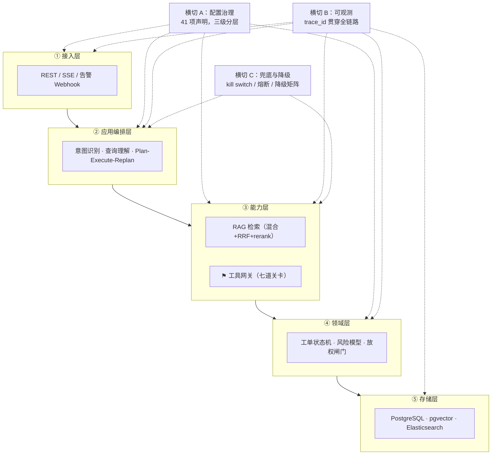

# 项目落地度评估与分层设计

> 回答两个问题：**这是不是一个真正能落地的企业 AI 系统？有几层设计？**
>
> 回答方式：不凭印象。**先把"已有代码"和"只有文档"分清楚**（§1 的数据是 grep 出来的），
> 再回答分层（§2–§7）。

---

## 1. 落地度：诚实的现状

### 1.1 已有代码 vs 只有文档

| 能力 | 代码文件数 | 状态 |
|------|----------|------|
| 工单状态机（12 状态 / 15 事件） | 4 | ✅ 已实现 + 测试 |
| 工具风险模型 / 策略 | 4 | ✅ 已实现 |
| 放权闸门 `AutonomyGate` | 3 | ✅ 已实现 |
| 配置治理（41 项 + 校验 + 审计 + JDBC） | 18 | ✅ 已实现 + 测试 |
| 配置 REST + 双人复核 | 12 | ✅ 已实现 + 测试 |
| 工具网关七道关卡 | 13 | ✅ 已实现 + 测试 |
| **LLM 调用 `ChatModel`** | **0** | ❌ **只有文档** |
| **向量检索 `VectorStore`** | **0** | ❌ **只有文档** |
| **向量化 `EmbeddingModel`** | **0** | ❌ **只有文档** |
| **文本切片 `TextSplitter`** | **0** | ❌ **只有文档** |
| **Agent 编排 `StateGraph`** | **0** | ❌ **只有文档** |
| **对话 `ChatClient`** | **0** | ❌ **只有文档** |

**合计：78 个生产类 / 22 个测试类 / 304 个测试。**

> 计数说明：`304 / 22` 是 CI run `33984843271` 的实测值
> （`报告文件=22 测试总数=304 失败=0 错误=0 跳过=0`）；
> 生产类 78 个是本地文件清点（CI 不统计此项）。
> 上一轮实测值是 `280 / 20 / 75`（run `33983334064`），
> 本轮为不变量 I8 新增 3 个生产类、2 个测试类、24 个用例，
> 见 [DEVELOPMENT.md](DEVELOPMENT.md) §1.5。

新增的 17 个生产类是 `oncall-ontology`（轻量本体：概念层 / 关系层 / 4 条规则）。
它属于**知识表示**，不是安全与治理——所以严格说不再是"全部集中在安全这一半"。
但它是**确定性 Java，零 AI 依赖**：上表那六个 AI 组件的代码文件数仍然是 0，
"AI 能力那一半一行代码都没有"这句仍然成立。
本体是那一半将要消费的输入，不是那一半本身。

规划的 `oncall-agent` / `oncall-knowledge` / `oncall-eval` **三个模块目录都还不存在**。

### 1.2 所以，判决

> **设计上可落地；工程上还没落地；而落地的顺序是对的。**

**"顺序是对的"这句话需要论证**，否则听起来像辩解：

| 已建的部分有什么共性 | 未建的部分有什么共性 |
|-------------------|-------------------|
| **改不了要重来**：工具网关是基石，事后加等于重写所有工具调用 | 可以后加：编排逻辑、检索逻辑都是新增模块，不动已有代码 |
| **返工风险全在这里**：`开工前决策冻结与返工风险评估.md` 的 5 个 P0 决策有 3 个落在配置与工具层 | 依赖未解决的信息缺口（见 §1.3） |
| **零外部依赖即可验证**：CI 能完整跑，184 个测试都是确定性的 | 依赖外部系统：模型 API、向量库、CMDB、企微 |
| 不依赖任何未确认的前提 | **依赖 3 个还没答案的问题** |

### 1.3 挡在前面的三个信息缺口（不是技术问题）

| 缺口 | 卡住什么 |
|------|---------|
| **知识库清单**（有多少文档、什么格式、谁维护） | M4 全部。不知道量就无法估算索引成本与冷启动周期 |
| **CMDB 的告警→服务映射** | M5 影响面分析、@ 对人、以及本体的关系层 |
| **R10 数据出域合规评审** | **整个方案**。不通过就要改成私有化模型，架构要重画 |

**R10 是最要命的一个**，而且它不需要写任何代码就能推进——
所以我一直建议它第 1 周就启动，而不是等到 M4。

### 1.4 要成为"真正能落地的企业 AI 系统"，还差什么

| # | 缺口 | 阶段 | 备注 |
|---|------|------|------|
| 1 | R10 安全评审通过 | **前置** | 不通过则架构重画 |
| 2 | ~~ArchUnit 规则（F9）~~ | ~~M2~~ | ✅ **已完成**，`oncall-archtest` |
| 3 | ~~11 张表建 9 张~~ | ~~M2~~ | ✅ **已完成并在真实 PostgreSQL 16 + pgvector 上验证**（V1–V7 共 16 张表，`uq_agent_step_idem`、`chk_approval_not_self`、`chk_claim_state`、`tool_execution_claim` 主键四条都已写成 CI 断言） |
| 4 | Agent 编排 + 成本埋点 | M3 | 第一次真正调模型 |
| 5 | RAG 全链路 | M4 | 依赖知识库清单 |
| 6 | 告警接入 + 工单 + 企微 | M5 | 依赖 CMDB 映射 |
| 7 | 评测体系 + 可观测 | M6 | Golden Set ≥ 20 条 |
| 8 | S0 影子模式跑通 | M7 | **这才算"能落地"** |

**判断"能不能落地"的标准应该是第 8 条**：S0 影子模式在真实告警上跑通，
且引用幻觉率 = 0、拒答率在 5–25% 区间。在那之前，一切都还是设计。

---

## 2. 架构分层：5 层 + 3 个横切

**为什么横切不算层**：它们不参与请求的纵向流转，而是被每一层调用。
把配置治理画成"一层"会导致依赖方向混乱（配置层要反过来调用业务层）。

**当前落地度**：① 部分（配置 REST）✅；② ❌；③ 工具网关 ✅、RAG ❌；④ ✅；⑤ 2/11 张表。

---

## 3. 防护分层：10 层

这是本项目设计密度最高的地方。**每一层解决一类失效，层与层之间不重叠。**

| # | 层 | 解决什么 | 失效时的后果 | 状态 |
|---|-----|---------|------------|------|
| 1 | **意图层**：规则前置确定性判定 `EXECUTE` | 安全分类不能交给概率 | 高危操作绕过审批 | ⬜ M3 |
| 2 | **输入层**：脱敏 + `<tool_output trust="untrusted">` 包裹 | 提示注入、数据出域 | 日志里的注入指令被当指令执行 | ⬜ M3 |
| 3 | **计划层**：`PlanValidator` 静态校验 | 高危步骤无可追溯依据 | 模型编造一个"重启数据库"的步骤 | ⬜ M3 |
| 4 | **检索层**：`CitationVerifier` | 引用幻觉 | 答案引用不存在的文档 | ⬜ M4 |
| 5 | **工具层**：`GuardedToolCallback` **七道关卡** | 一切写操作 | **基石失守，上面全部失效** | ✅ **已实现** |
| 6 | **审批层**：`ApprovalGate` + 审批人看到夹紧后的值 | 越权执行 | 批的和执行的不是同一个东西 | ✅ 已实现 |
| 7 | **预算层**：三重护栏（步数 / token / 成本） | 失控与超支 | 一次告警烧掉全天配额 | ⬜ M3 |
| 8 | **兜底层**：降级矩阵 + 熔断 + kill switch | 依赖失效 | LLM 挂了整个系统不可用 | 部分 ✅ |
| 9 | **审计层**：`trace_id` 贯穿 4 张表 | 不可追溯 | 出事后无法回答"谁批的、当时看到什么" | ⬜ M2 |
| 10 | **治理层**：配置双人复核 + 高危清单硬编码 | 配置即提权 | 改一个配置等于给自己提权 | ✅ **已实现** |

**已实现的是第 5、6、10 层——恰好是最不能事后补的三层。**

> **第 5 层为什么是基石**：其余 9 层都**假设**工具网关会被执行。
> 它一旦被绕过，全部变成装饰。所以必须有 ArchUnit 禁止在网关外直接调
> `ToolCallback.call`（**这条还没实现**）。

---

## 4. 放权分层：4 级

| 级 | AI 能做什么 | 责任人 | 晋级门槛 |
|----|-----------|-------|---------|
| **S0 影子** | 只记录，不建议不执行 | 人 | 起点 |
| **S1 建议** | 给建议，人执行 | 执行的人 | S0 稳定 + 引用幻觉率 = 0 |
| **S2 辅助** | AI 执行，人审批 | **审批的人** | S1 稳定 + 误操作率 = 0 |
| **S3 限定自动** | 白名单内自主执行 | 设定白名单的人 | S2 稳定 3 个月 |
| ~~S4 完全自动~~ | — | — | **已评估并否决** |

**出现 1 次误操作即自动降一级，降级不需要审批。**

---

## 5. 测试分层：5 层

| 层 | 测什么 | 确定性 | 触发 | 状态 |
|----|-------|-------|------|------|
| L1 单元 | 状态机 / 夹紧 / 策略 / 配置校验 / 本体规则 | 确定 | 每次 push | ✅ **243 个** |
| L2 组件 | 编排 / 上下文装配 / 兜底分支（`StubChatModel`） | 确定 | 每次 push | ⬜ |
| L3 行为回归 | Golden Set 质量指标 | **非确定** | 每晚 + 发版前 | ⬜ |
| L4 契约 | 外部系统接口形状 | 确定 | 每次 push | ⬜ |
| L5 端到端 | 全链路 | 半确定 | 发版前 | ⬜ |

**金字塔之外还有一道架构约束检查（ArchUnit，8 个用例），但它不是 L0，也不是金字塔的一层。**

理由与「配置治理 / 可观测 / 兜底不算架构层」是同一个：金字塔的层按**验证对象的粒度**
从细到粗纵向排列（方法 → 组件 → 行为 → 契约 → 链路），而架构约束检查的是**类的依赖图**，
不在这条轴上。把它塞进金字塔会让人以为它是「比 L1 更细的一层」，其实它测的东西完全不同。

> 它单独存在的价值：**行为测试全绿时，架构约束仍然可能已经被破坏。**
> 新写一个绕过 `GuardedToolCallback` 的 `ToolCallback` 实现，
> 编译通过、启动正常、L1–L5 一个都不会红——只有架构约束会红。

L1 的 243 + 架构约束 8 = 当前 CI 的 **251** 个用例。

**关键设计**：L2 用假模型，**把非确定性挡在 CI 之外**。
在 CI 里调真模型会让 CI 间歇性变红，而间歇性变红的 CI 等于没有 CI。

---

## 6. 配置分层：3 级

判据不是"这个参数重不重要"，而是**"改了它会发生什么"**。

| 级 | 数量 | 判据 | 前端可见 |
|----|------|------|---------|
| `RUNTIME_HOT` | 23 | 改了立即生效，无副作用 | ✅ 主战场 |
| `REQUIRES_MIGRATION` | 8 | 改了要迁移数据，必须带 `migrationHint` | ✅ 带警告 |
| `BACKEND_ONLY` | 8 | **键名都不外泄** | ❌ 返回 404 |

`BACKEND_ONLY` 的三类：兜底配置、DDL 绑定项、凭据。

---

## 7. 设计文档分层：4 类 24 份

| 类 | 文档 | 作用 |
|----|------|------|
| **① 交付产物（8）** | PRD / 架构与选型 / API 规范 / 编码规范 / 数据库 / 部署 / README / DEVELOPMENT | 给别人看的标准产物 |
| **② 评审决策（5）** | 架构评审报告 / 修复方案 / 开工前决策冻结 / 端到端链路复核 / 项目落地度评估与分层设计 | **为什么是现在这个样子** |
| **③ 专项设计（7）** | 质量与可靠性 / 配置外置 / 可行性优化 / 测试与交付 / 查询理解 / 轻量本体 / 本体论方法论评估 | 单个难题的深潜 |
| **④ 协作（3）** | AGENTS / CLAUDE / DEVLONG | 给未来的开发会话（人或 AI） |
| 附：原始方案（1） | 架构设计方案 | **已被②③修订**，保留作对照 |

> **②和④是这套文档里最不常见、也最有价值的两类。**
> 大多数项目只有①和③——只有"是什么"，没有"为什么不是别的"，
> 结果每一轮都重新争论一遍已经解决过的问题。
> `DEVLONG.md` 里的"13 个已否决方案"和"8 个已核实为正确的疑点"就是为了堵这个。

---

## 8. 一句话总结

**分层的答案**：

| 视角 | 层数 |
|------|------|
| 架构（纵向） | **5 层** + 3 个横切 |
| 防护 | **10 层** |
| 放权 | **4 级**（S4 已否决） |
| 测试 | **5 层** |
| 配置 | **3 级** |
| 文档 | **4 类 24 份** |

**落地度的答案**：

> **现在它是一个"安全与治理骨架已落地、AI 能力全部还是文档"的项目。**
> 78 个生产类、304 个测试，其中 61 个类在安全与治理、17 个在知识表示（轻量本体）；
> LLM 调用、向量检索、文本切片、Agent 编排、对话，**代码文件数都是 0**。
>
> **这不是进度落后，是有意的顺序**：先建改不了要重来的部分（基石、配置治理），
> 后建依赖未确认前提的部分（模型、知识库、CMDB）。
>
> **判断"真正能落地"的标准是 S0 影子模式在真实告警上跑通**，
> 且引用幻觉率 = 0、拒答率在 5–25% 区间。在那之前，一切都还是设计。
>
> 而挡在前面的三件事里，**R10 数据出域合规评审不需要写任何代码就能推进**——
> 它应该现在就开始，而不是等到 M4。
